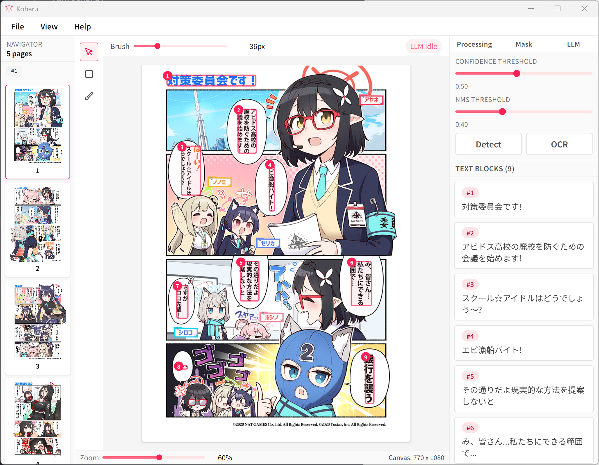

# Koharu

AI-powered manga translator, written in **Rust**.

Koharu introduces a new workflow for manga translation, utilizing the power of AI to automate the process. It combines the capabilities of object detection, OCR, inpainting, and LLMs to create a seamless translation experience.

Under the hood, Koharu uses [ort](https://github.com/pykeio/ort) and [candle](https://github.com/huggingface/candle) for high-performance inference, and uses [Tauri](https://github.com/tauri-apps/tauri) for the GUI. All components are written in Rust, ensuring safety and speed.




> [!NOTE]
> For help and support, please join our [Discord server](https://discord.gg/mHvHkxGnUY).

## Features

- Automatic speech bubble detection and segmentation
- OCR for manga text recognition
- Inpainting to remove original text from images
- LLM-powered translation
- Vertical text layout for CJK languages

## GPU acceleration

Currently, Koharu only supports NVIDIA GPUs via CUDA.

### CUDA

Koharu is built with CUDA support, allowing it to leverage the power of NVIDIA GPUs for faster processing.

Koharu bundles CUDA toolkit 12 and cuDNN 9, so you don't need to install them separately. Just make sure you have the appropriate NVIDIA drivers installed on your system.

## Models

Koharu relies on a mixin of ONNX models and LLM models to perform various tasks.

### ONNX models

Koharu uses several pre-trained models for different tasks:

- [comic-text-detector](https://github.com/dmMaze/comic-text-detector)
- [manga-ocr](https://github.com/kha-white/manga-ocr)
- [AnimeMangaInpainting](https://huggingface.co/dreMaz/AnimeMangaInpainting)

The models will be automatically downloaded when you run Koharu for the first time.

We convert the original models to ONNX format for better performance and compatibility with Rust. The converted models are hosted on [Hugging Face](https://huggingface.co/mayocream).

### LLMs

Koharu supports various quantized LLMs in GGUF format via [candle](https://github.com/huggingface/candle). Currently supported models include:

- [vntl-llama3-8b-v2](https://huggingface.co/lmg-anon/vntl-llama3-8b-v2-gguf)
- [sakura-galtransl-7b-v3.7](https://huggingface.co/SakuraLLM/Sakura-GalTransl-7B-v3.7)

## Installation

You can download the latest release of Koharu from the [releases page](https://github.com/mayocream/koharu/releases/latest).

We provide pre-built binaries for Windows, for other platforms, you may need to build from source, see the [Development](#development) section below.

## Development

### Prerequisites

- [Rust](https://www.rust-lang.org/tools/install) (1.85 or later)
- [Bun](https://bun.sh/) (1.0 or later)

### Install dependencies

```bash
bun install
```

### Build

```bash
bun run build
```

The built binaries will be located in the `target/release` directory.

## Sponsorship

If you find Koharu useful, consider sponsoring the project to support its development. Either via GitHub Sponsors or Patreon.

<iframe src="https://github.com/sponsors/mayocream/button" title="Sponsor Mayo" height="32" width="114" style="border: 0; border-radius: 6px;"></iframe>

## License

Koharu application is licensed under the [GNU General Public License v3.0](LICENSE-GPL).

The sub-crates of Koharu are licensed under the [Apache License 2.0](LICENSE-APACHE).
