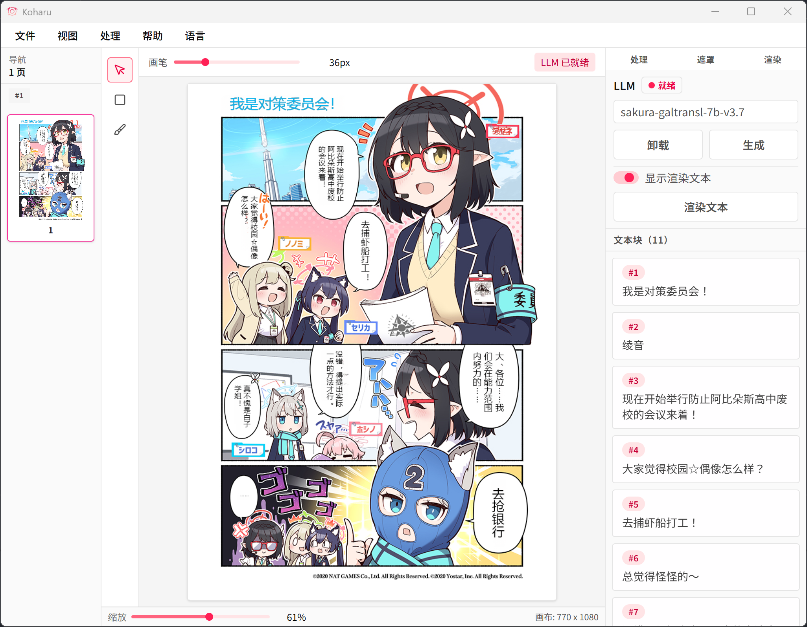

# Koharu

[日本語](./README.ja.md)

ML-powered manga translator, written in **Rust**.

Koharu introduces a new workflow for manga translation, utilizing the power of ML to automate the process. It combines the capabilities of object detection, OCR, inpainting, and LLMs to create a seamless translation experience.

Under the hood, Koharu uses [candle](https://github.com/huggingface/candle) for high-performance inference, and uses [Tauri](https://github.com/tauri-apps/tauri) for the GUI. All components are written in Rust, ensuring safety and speed.

> [!NOTE]
> Koharu runs ML models **locally** on your machine, ensuring your data privacy. No data is sent to external servers. We guarantee that Koharu does not collect any user data.

---



> [!NOTE]
> For help and support, please join our [Discord server](https://discord.gg/mHvHkxGnUY).

## Features

- Automatic speech bubble detection and segmentation
- OCR for manga text recognition
- Inpainting to remove original text from images
- LLM-powered translation
- Vertical text layout for CJK languages

## Usage

### Hot keys

- <kbd>Ctrl</kbd> + Mouse Wheel: Zoom in/out
- <kbd>Ctrl</kbd> + Drag: Pan the canvas
- <kbd>Del</kbd>: Delete selected text block

### Headless Mode

Koharu can be run in headless mode via command line.

```bash
# macOS / Linux
koharu --port 4000 --headless
# Windows
koharu.exe --port 4000 --headless
```

You can now access Koharu Web UI at `http://<your-server-ip>:4000`.

### File association

On Windows, Koharu automatically associates `.khr` files, so you can open them by double-clicking. The `.khr` files can also be opened
from as picture to view the thumbnails of the contained images.

## GPU acceleration

CUDA and Metal are supported for GPU acceleration, significantly improving performance on supported hardware.

### CUDA

Koharu is built with CUDA support, allowing it to leverage the power of NVIDIA GPUs for faster processing.

Koharu bundles CUDA toolkit 12.x and cuDNN 9.x, dylibs will be automatically extracted to the application data directory on first run.

#### Supported NVIDIA GPUs

Koharu supports NVIDIA GPUs with compute capability 7.5 or higher.

Please make sure your GPU is supported by checking the [CUDA GPU Compute Capability](https://developer.nvidia.com/cuda-gpus) and the [cuDNN Support Matrix](https://docs.nvidia.com/deeplearning/cudnn/backend/latest/reference/support-matrix.html).

### Metal

Koharu supports Metal for GPU acceleration on macOS with Apple Silicon (M1, M2, etc.). This allows Koharu to run efficiently on a wide range of Apple devices.

### CPU fallback

You can always force Koharu to use CPU for inference:

```bash
# macOS / Linux
koharu --cpu
# Windows
koharu.exe --cpu
```

## ML Models

Koharu relies on a mixin of computer vision and natural language processing models to perform its tasks.

### Computer Vision Models

Koharu uses several pre-trained models for different tasks:

- [comic-text-detector](https://github.com/dmMaze/comic-text-detector)
- [manga-ocr](https://github.com/kha-white/manga-ocr)
- [AnimeMangaInpainting](https://huggingface.co/dreMaz/AnimeMangaInpainting)
- [YuzuMarker.FontDetection](https://github.com/JeffersonQin/YuzuMarker.FontDetection)

The models will be automatically downloaded when you run Koharu for the first time. Windows user can download the `Koharu-win-CUDA-bundled.7z` release package to get those models pre-bundled.

We convert the original models to safetensors format for better performance and compatibility with Rust. The converted models are hosted on [Hugging Face](https://huggingface.co/mayocream).

### Large Language Models

Koharu supports various quantized LLMs in GGUF format via [candle](https://github.com/huggingface/candle), and preselect model based on system locale settings. Supported models and suggested usage:

For translating to English:

- [vntl-llama3-8b-v2](https://huggingface.co/lmg-anon/vntl-llama3-8b-v2-gguf): ~8.5 GB Q8_0 weight size and suggests >=10 GB VRAM or plenty of system RAM for CPU inference, best when accuracy matters most.
- [lfm2-350m-enjp-mt](https://huggingface.co/LiquidAI/LFM2-350M-ENJP-MT-GGUF): ultra-light (≈350M, Q8_0); runs comfortably on CPUs and low-memory GPUs, ideal for quick previews or low-spec machines at the cost of quality.

For translating to Chinese:

- [sakura-galtransl-7b-v3.7](https://huggingface.co/SakuraLLM/Sakura-GalTransl-7B-v3.7): ~6.3 GB and fits on 8 GB VRAM, good balance of quality and speed.
- [sakura-1.5b-qwen2.5-v1.0](https://huggingface.co/shing3232/Sakura-1.5B-Qwen2.5-v1.0-GGUF-IMX): lightweight (≈1.5B, Q5KS); fits on mid-range GPUs (4–6 GB VRAM) or CPU-only setups with moderate RAM, faster than 7B/8B while keeping Qwen-style tokenizer behavior.

For other languages, you may use:

- [hunyuan-7b-mt-v1.0](https://huggingface.co/Mungert/Hunyuan-MT-7B-GGUF): ~6.3GB and fits on 8 GB VRAM, decent multi-language translation quality.

LLMs will be automatically downloaded on demand when you select a model in the settings. Choose the smallest model that meets your quality needs if you are memory-bound; prefer the 7B/8B variants when you have sufficient VRAM/RAM for better translations.

## Installation

You can download the latest release of Koharu from the [releases page](https://github.com/mayocream/koharu/releases/latest).

We provide pre-built binaries for Windows and macOS, for other platforms, you may need to build from source, see the [Development](#development) section below.

## Development

To build Koharu from source, follow the steps below.

### Prerequisites

- [Rust](https://www.rust-lang.org/tools/install) (1.92 or later)
- [Bun](https://bun.sh/) (1.0 or later)

### Install dependencies

```bash
bun install
```

### Build

```bash
bun run build
```

The built binaries will be located in the `target/release` directory.

## Sponsorship

If you find Koharu useful, consider sponsoring the project to support its development!

- [GitHub Sponsors](https://github.com/sponsors/mayocream)
- [Patreon](https://www.patreon.com/mayocream)

## License

Koharu application is licensed under the [GNU General Public License v3.0](LICENSE-GPL).

The sub-crates of Koharu are licensed under the [Apache License 2.0](LICENSE-APACHE).
