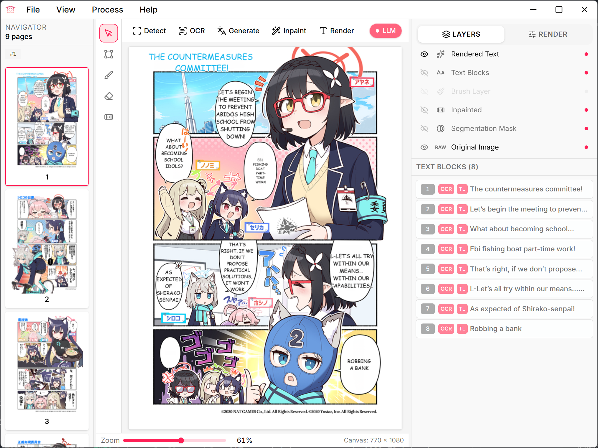

# Koharu

[Documentation](https://koharu.rs)

ML-powered manga translator, written in **Rust**.

Koharu introduces a new workflow for manga translation, utilizing the power of ML to automate the process. It combines the capabilities of object detection, OCR, inpainting, and LLMs to create a seamless translation experience.

Under the hood, Koharu uses [candle](https://github.com/huggingface/candle) and [llama.cpp](https://github.com/ggml-org/llama.cpp) for high-performance inference, and uses [Tauri](https://github.com/tauri-apps/tauri) for the GUI. All components are written in Rust, ensuring safety and speed.

> [!NOTE]
> Koharu runs its vision models and local LLMs **locally** on your machine by default. If you choose a remote LLM provider, Koharu sends translation text only to the provider you configured. Koharu itself does not collect user data.

---



> [!NOTE]
> For help and support, join the [Discord server](https://discord.gg/mHvHkxGnUY).

## Features

- Automatic detection of text regions, speech bubbles, and cleanup masks
- OCR for manga dialogue, captions, and other page text
- Inpainting to remove source lettering from the page
- Translation with local or remote LLM backends
- Vertical CJK layout and text rendering with automatic contrasting black/white default outlines
- Layered PSD export with editable text
- Local HTTP API and MCP server for automation

If you just want to get started, see [Install Koharu](https://koharu.rs/how-to/install-koharu/) and [Translate Your First Page](https://koharu.rs/tutorials/translate-your-first-page/).

## Usage

### Hot keys

- <kbd>Ctrl</kbd> + Mouse Wheel: Zoom in/out
- <kbd>Ctrl</kbd> + Drag: Pan the canvas
- <kbd>Del</kbd>: Delete selected text block

### Export

Koharu can export the current page either as a rendered image or as a layered Photoshop PSD. PSD export keeps helper layers and writes translated text as editable text layers, which makes manual cleanup much easier when the automatic pass gets you most of the way there.

For export behavior, PSD contents, and file naming, see [Export Pages and Manage Projects](https://koharu.rs/how-to/export-and-manage-projects/).

### MCP Server

Koharu includes a built-in MCP server for agent workflows. By default it listens on a random local port, but you can pin it with `--port`.

```bash
# macOS / Linux
koharu --port 9999
# Windows
koharu.exe --port 9999
```

Then point your client at `http://localhost:9999/mcp`.

For local setup and the available tools, see [Run GUI, Headless, and MCP Modes](https://koharu.rs/how-to/run-gui-headless-and-mcp/), [Configure MCP Clients](https://koharu.rs/how-to/configure-mcp-clients/), and [MCP Tools Reference](https://koharu.rs/reference/mcp-tools/).

### Headless Mode

Koharu can also run without opening the desktop window.

```bash
# macOS / Linux
koharu --port 4000 --headless
# Windows
koharu.exe --port 4000 --headless
```

You can then open the Web UI at `http://localhost:4000`.

For runtime modes, ports, and local endpoints, see [Run GUI, Headless, and MCP Modes](https://koharu.rs/how-to/run-gui-headless-and-mcp/).

### Runtime settings

`Settings > Runtime` controls the shared local data path plus HTTP connect timeout, read timeout, and retry count used by downloads and provider requests.

Those values are loaded at startup, so applying changes saves the config and restarts the app.

## GPU acceleration

Koharu supports CUDA, Metal, and Vulkan. CPU fallback is always available when the accelerated path is unavailable or not worth the setup cost on your system.

### CUDA (NVIDIA GPUs on Windows)

On Windows, Koharu ships with CUDA support so it can use NVIDIA GPUs for the full local pipeline.

Koharu bundles CUDA Toolkit 13.1. The required DLLs are extracted to the application data directory on first run.

> [!NOTE]
> Make sure you have current NVIDIA drivers installed. You can update them through [NVIDIA App](https://www.nvidia.com/en-us/software/nvidia-app/).

#### Supported NVIDIA GPUs

Koharu supports NVIDIA GPUs with compute capability 7.5 or higher.

If you want to confirm GPU support, see [CUDA GPU Compute Capability](https://developer.nvidia.com/cuda-gpus) and the [cuDNN Support Matrix](https://docs.nvidia.com/deeplearning/cudnn/backend/latest/reference/support-matrix.html).

### Metal (Apple Silicon on macOS)

Koharu supports Metal on Apple Silicon Macs. No extra runtime setup is required beyond a normal app install.

### Vulkan (Windows and Linux)

Koharu also supports Vulkan on Windows and Linux. This backend is currently used primarily for OCR and local LLM inference.

Detection and inpainting still depend on CUDA or Metal, so Vulkan is useful but not a full replacement for the main accelerated path. AMD and Intel GPUs can still benefit from it, but the best all-around experience is still NVIDIA on Windows or Apple Silicon on macOS.

### CPU fallback

You can always force Koharu to use CPU for inference:

```bash
# macOS / Linux
koharu --cpu
# Windows
koharu.exe --cpu
```

For backend selection, fallback behavior, and model runtime support, see [Acceleration and Runtime](https://koharu.rs/explanation/acceleration-and-runtime/).

## ML Models

Koharu uses a staged stack of vision and language models instead of trying to solve the entire page with a single network.

### Computer Vision Models

Koharu uses multiple pretrained models, each tuned for a specific part of the page pipeline:

- [comic-text-bubble-detector](https://huggingface.co/ogkalu/comic-text-and-bubble-detector) for joint text block and speech bubble detection
- [comic-text-detector](https://huggingface.co/mayocream/comic-text-detector) for text segmentation masks
- [PaddleOCR-VL-1.5](https://huggingface.co/PaddlePaddle/PaddleOCR-VL-1.5) for OCR text recognition
- [aot-inpainting](https://huggingface.co/mayocream/aot-inpainting) for default inpainting
- [YuzuMarker.FontDetection](https://huggingface.co/fffonion/yuzumarker-font-detection) for font and color detection

Optional built-in alternatives available in **Settings > Engines** include:

- [PP-DocLayoutV3](https://huggingface.co/PaddlePaddle/PP-DocLayoutV3_safetensors) as an alternative detector and layout-analysis engine
- [speech-bubble-segmentation](https://huggingface.co/mayocream/speech-bubble-segmentation) as a dedicated speech bubble detector
- [Manga OCR](https://huggingface.co/mayocream/manga-ocr) and [MIT 48px OCR](https://huggingface.co/mayocream/mit48px-ocr) as alternative OCR engines
- [lama-manga](https://huggingface.co/mayocream/lama-manga) as an alternative inpainter

Koharu downloads the required models automatically on first use.

Some models are consumed directly from upstream Hugging Face repos, while Rust-friendly `safetensors` conversions are hosted on [Hugging Face](https://huggingface.co/mayocream) when Koharu needs a converted bundle.

For a closer look at the pipeline, see [Models and Providers](https://koharu.rs/explanation/models-and-providers/) and the [Technical Deep Dive](https://koharu.rs/explanation/technical-deep-dive/).

### Large Language Models

Koharu supports both local and remote LLM backends. When possible, it also tries to preselect sensible defaults based on your system locale.

#### Local LLMs

Koharu supports quantized GGUF models through [llama.cpp](https://github.com/ggml-org/llama.cpp). These models run on your machine and are downloaded on demand when you select them in Settings.

If you want general-purpose local models first, the built-in picker includes:

- Gemma 4 instruct: [gemma4-e2b-it](https://huggingface.co/unsloth/gemma-4-E2B-it-GGUF), [gemma4-e4b-it](https://huggingface.co/unsloth/gemma-4-E4B-it-GGUF), [gemma4-26b-a4b-it](https://huggingface.co/unsloth/gemma-4-26B-A4B-it-GGUF), [gemma4-31b-it](https://huggingface.co/unsloth/gemma-4-31B-it-GGUF)
- Qwen 3.5: [qwen3.5-0.8b](https://huggingface.co/unsloth/Qwen3.5-0.8B-GGUF), [qwen3.5-2b](https://huggingface.co/unsloth/Qwen3.5-2B-GGUF), [qwen3.5-4b](https://huggingface.co/unsloth/Qwen3.5-4B-GGUF), [qwen3.5-9b](https://huggingface.co/unsloth/Qwen3.5-9B-GGUF), [qwen3.5-27b](https://huggingface.co/unsloth/Qwen3.5-27B-GGUF), [qwen3.5-35b-a3b](https://huggingface.co/unsloth/Qwen3.5-35B-A3B-GGUF)

If you want uncensored / NSFW-capable local models, the built-in picker also includes:

- Gemma 4 uncensored: [gemma4-e2b-uncensored](https://huggingface.co/HauhauCS/Gemma-4-E2B-Uncensored-HauhauCS-Aggressive), [gemma4-e4b-uncensored](https://huggingface.co/HauhauCS/Gemma-4-E4B-Uncensored-HauhauCS-Aggressive)
- Qwen 3.5 uncensored: [qwen3.5-2b-uncensored](https://huggingface.co/HauhauCS/Qwen3.5-2B-Uncensored-HauhauCS-Aggressive), [qwen3.5-4b-uncensored](https://huggingface.co/HauhauCS/Qwen3.5-4B-Uncensored-HauhauCS-Aggressive), [qwen3.5-9b-uncensored](https://huggingface.co/HauhauCS/Qwen3.5-9B-Uncensored-HauhauCS-Aggressive), [qwen3.5-27b-uncensored](https://huggingface.co/HauhauCS/Qwen3.5-27B-Uncensored-HauhauCS-Aggressive), [qwen3.5-35b-a3b-uncensored](https://huggingface.co/HauhauCS/Qwen3.5-35B-A3B-Uncensored-HauhauCS-Aggressive)

If you want fine-tuned translation models, built-in options include:

For translating to English:

- [vntl-llama3-8b-v2](https://huggingface.co/lmg-anon/vntl-llama3-8b-v2-gguf): around 8.5 GB in Q8_0, best when translation quality matters more than speed or memory use
- [lfm2.5-1.2b-instruct](https://huggingface.co/LiquidAI/LFM2.5-1.2B-Instruct-GGUF): a smaller multilingual instruct model that is easier to run on CPUs or low-memory GPUs
- [sugoi-14b-ultra](https://huggingface.co/sugoitoolkit/Sugoi-14B-Ultra-GGUF) and [sugoi-32b-ultra](https://huggingface.co/sugoitoolkit/Sugoi-32B-Ultra-GGUF): larger translation-oriented options when you have more VRAM or RAM available

For translating to Chinese:

- [sakura-galtransl-7b-v3.7](https://huggingface.co/SakuraLLM/Sakura-GalTransl-7B-v3.7): around 6.3 GB, a good balance of quality and speed on 8 GB GPUs
- [sakura-1.5b-qwen2.5-v1.0](https://huggingface.co/shing3232/Sakura-1.5B-Qwen2.5-v1.0-GGUF-IMX): lighter and faster, useful on mid-range GPUs or CPU-only setups

For broader language coverage:

- [hunyuan-mt-7b](https://huggingface.co/Mungert/Hunyuan-MT-7B-GGUF): around 6.3 GB, with broad multilingual translation coverage

LLMs are downloaded on demand when you pick a model in Settings. If you are constrained by memory, start with a smaller model. If you have the VRAM or RAM budget, the 7B and 8B models generally produce better translations.

#### Remote LLMs

Koharu can also translate through remote or self-hosted API providers instead of a downloaded local model. Supported remote providers:

- OpenAI
- Gemini
- Claude
- DeepSeek
- OpenAI Compatible, including LM Studio, OpenRouter, or any endpoint that exposes the OpenAI-style `/v1/models` and `/v1/chat/completions` APIs

Current built-in remote model defaults:

- OpenAI: `gpt-5-mini` (`GPT-5 mini`)
- Gemini: `gemini-3.1-flash-lite-preview` (`Gemini 3.1 Flash-Lite Preview`)
- Claude: `claude-haiku-4-5` (`Claude Haiku 4.5`)
- DeepSeek: `deepseek-chat` (`DeepSeek-V3.2-Chat`)
- OpenAI Compatible: models are discovered from the configured endpoint

Remote providers are configured in **Settings > API Keys**. OpenAI-compatible providers also need a custom base URL. API keys are optional for local servers such as LM Studio, but are usually required for hosted services such as OpenRouter.

Use a remote provider if you do not want to download local models, if you want to reduce local VRAM or RAM use, or if you already have a hosted model endpoint. Keep in mind that the OCR text selected for translation is sent to the provider you configured.

For LM Studio, OpenRouter, and other OpenAI-style endpoints, see [Use OpenAI-Compatible APIs](https://koharu.rs/how-to/use-openai-compatible-api/). For provider configuration, see [Settings Reference](https://koharu.rs/reference/settings/).

## Installation

You can download the latest release of Koharu from the [releases page](https://github.com/mayocream/koharu/releases/latest).

We provide prebuilt binaries for Windows, macOS, and Linux. For the standard install flow, see [Install Koharu](https://koharu.rs/how-to/install-koharu/). If something goes wrong, see [Troubleshooting](https://koharu.rs/how-to/troubleshooting/).

## Development

To build Koharu from source, follow the steps below.

### Prerequisites

- [Rust](https://www.rust-lang.org/tools/install) 1.92 or later
- [Bun](https://bun.sh/) 1.0 or later

### Install dependencies

```bash
bun install
```

### Build

```bash
bun run build
```

If you want more direct control over the Tauri build:

```bash
bun tauri build --release --no-bundle
```

The built binaries are written to `target/release`.

For platform-specific build notes, see [Build From Source](https://koharu.rs/how-to/build-from-source/). For the local development workflow, see [Contributing](https://koharu.rs/how-to/contributing/).

## Sponsorship

If Koharu is useful in your workflow, consider sponsoring the project.

- [GitHub Sponsors](https://github.com/sponsors/mayocream)
- [Patreon](https://www.patreon.com/mayocream)

## Contributors

<a href="https://github.com/mayocream/koharu/graphs/contributors">
  
</a>

## License

Koharu is licensed under the [GNU General Public License v3.0](LICENSE).
