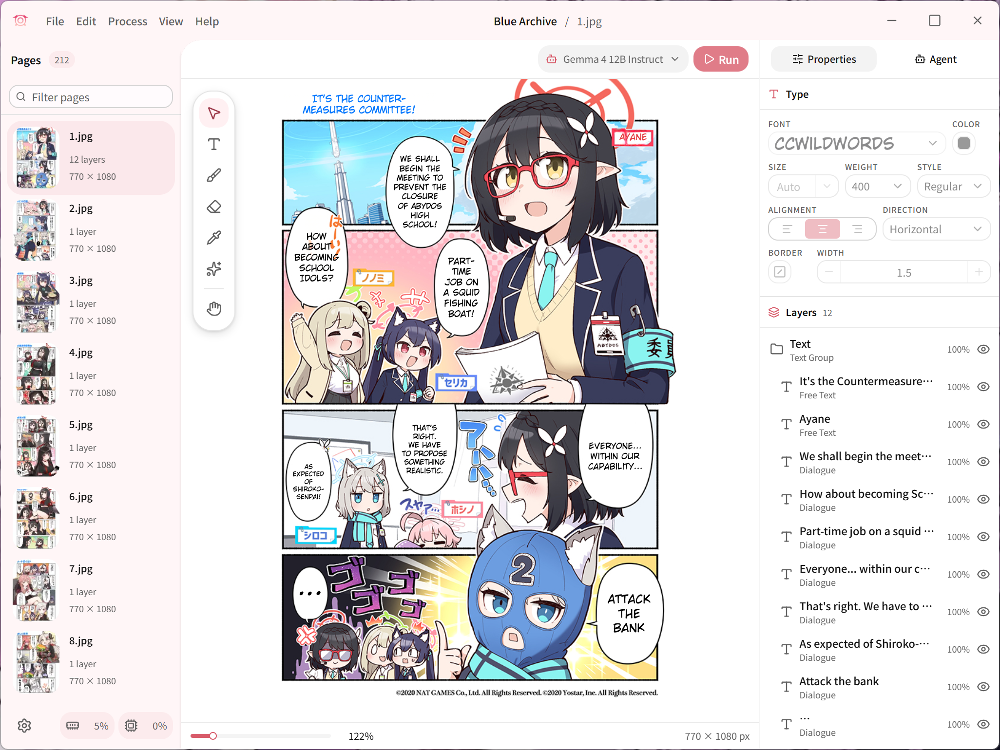
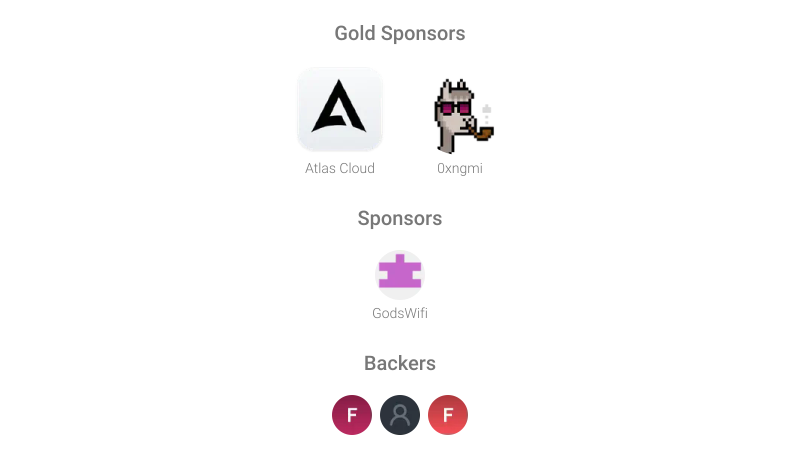

<h1 align="center">Koharu</h1>

<p align="center">ML-powered manga translator, written in <b>Rust</b>.</p>

<p align="center">
<a href="https://github.com/mayocream/koharu/releases/latest" target="_blank"></a>
</p>

<p align="center">
<a href="https://trendshift.io/repositories/20649" target="_blank"></a>
</p>

<p align="center">
<a href="https://koharu.rs/getting-started/install/" target="_blank">Getting Started</a> · <a href="https://koharu.rs/" target="_blank">Docs</a> · <a href="https://github.com/mayocream/koharu/issues" target="_blank">Bug reports</a> · <a href="https://discord.gg/mHvHkxGnUY" target="_blank">Discord</a>
</p>

<p align="center">
<a href="https://koharu.rs/ja-JP/" target="_blank">日本語</a> | <a href="https://koharu.rs/zh-CN/" target="_blank">简体中文</a>
</p>

Koharu introduces a local-first workflow for manga translation, utilizing the power of ML to automate the process. It combines the capabilities of object detection, OCR, inpainting, and LLMs to create a seamless translation experience.

> [!NOTE]
> Koharu runs its vision models and LLMs **locally** on your machine to keep your data private and secure.

---



> [!NOTE]
> Support and discussion are available on the [Discord server](https://discord.gg/mHvHkxGnUY).

## Features

- Automatic detection of text regions, speech bubbles, and cleanup masks
- OCR for manga dialogue, captions, and other page text
- Inpainting to remove source lettering from the page
- Translation with local or remote LLM backends
- Advanced text rendering with vertical CJK and RTL support
- Layered PSD export with editable text

## Hardware Acceleration

Koharu supports CUDA and ROCm / HIP on Windows and Linux, Metal on Apple silicon, and Vulkan on Windows and Linux.

### CUDA

Koharu uses CUDA 13.0 for NVIDIA GPUs on Windows and Linux. Install the [latest NVIDIA driver](https://www.nvidia.com/en-us/drivers/) before starting Koharu; [CUDA 13.0 requires R580 or newer](https://docs.nvidia.com/cuda/archive/13.0.0/cuda-toolkit-release-notes/index.html#cuda-driver).

### ROCm / HIP

Koharu supports AMD GPUs on Windows and Linux through ROCm and HIP. Before starting Koharu, download and install the [ROCm Core SDK with HIP](https://rocm.docs.amd.com/projects/HIP/en/latest/install/install.html) for your operating system.

### Metal

Koharu supports Metal on Apple Silicon Macs.

### Vulkan

Koharu also supports Vulkan on Windows and Linux as an alternative to CUDA and HIP.

### WebGPU

The editor canvas uses WebGPU inside Koharu's embedded CEF webview. A working WebGPU adapter and an up-to-date graphics driver are required even when ML inference falls back to CPU.

### CPU

CPU is the fallback when no supported accelerator is available or an accelerator cannot be initialized. It requires no GPU SDK, but inference will be slower.

## Machine Learning Models

Koharu uses a staged stack of vision and language models instead of trying to solve the entire page with a single network.

### Computer Vision Models

Koharu uses multiple pretrained models, each tuned for a specific part of the page pipeline.

#### Detection and Layout

Koharu uses object detection to find text regions, speech bubbles, and segmentation masks.

- [Koharu Layout RF-DETR Seg 2XL](https://huggingface.co/mayocream/koharu-layout-rfdetr-seg-2xl-1152)

#### OCR

These models recognize source text after detection.

- [PaddleOCR VL 1.6](https://huggingface.co/PaddlePaddle/PaddleOCR-VL-1.6)
- [Manga OCR](https://huggingface.co/mayocream/manga-ocr)
- [Baberu OCR](https://huggingface.co/genshiai-daichi/baberu-ocr)

#### Inpainting

These models remove source lettering before translated text is rendered back onto the page.

- [FLUX.2 Klein](https://huggingface.co/unsloth/FLUX.2-klein-4B-GGUF)
- [RORem mixed](https://huggingface.co/mayocream/RORem-mixed-GGUF)
- [LaMa](https://huggingface.co/mayocream/lama-manga)
- [AOT GAN](https://huggingface.co/mayocream/aot-inpainting)

### Large Language Models

Koharu has a flexible LLM backend that can run locally or connect to a remote API.

#### General-Purpose Local Models

- LFM 2.5: [lfm2.5-1.2b-instruct](https://huggingface.co/LiquidAI/LFM2.5-1.2B-Instruct-GGUF)
- Ministral 3: [ministral-3-8b-instruct](https://huggingface.co/mistralai/Ministral-3-8B-Instruct-2512-GGUF)
- Gemma 4: [gemma4-e2b-it](https://huggingface.co/unsloth/gemma-4-E2B-it-qat-GGUF), [gemma4-e4b-it](https://huggingface.co/unsloth/gemma-4-E4B-it-qat-GGUF), [gemma4-12b-it](https://huggingface.co/unsloth/gemma-4-12B-it-qat-GGUF), [gemma4-26b-a4b-it](https://huggingface.co/unsloth/gemma-4-26B-A4B-it-qat-GGUF), [gemma4-31b-it](https://huggingface.co/unsloth/gemma-4-31B-it-qat-GGUF)
- Qwen 3.5: [qwen3.5-0.8b](https://huggingface.co/unsloth/Qwen3.5-0.8B-GGUF), [qwen3.5-2b](https://huggingface.co/unsloth/Qwen3.5-2B-GGUF), [qwen3.5-4b](https://huggingface.co/unsloth/Qwen3.5-4B-GGUF), [qwen3.5-9b](https://huggingface.co/unsloth/Qwen3.5-9B-GGUF), [qwen3.5-27b](https://huggingface.co/unsloth/Qwen3.5-27B-GGUF), [qwen3.5-35b-a3b](https://huggingface.co/unsloth/Qwen3.5-35B-A3B-GGUF)
- Qwen 3.6: [qwen3.6-27b](https://huggingface.co/unsloth/Qwen3.6-27B-GGUF), [qwen3.6-35b-a3b](https://huggingface.co/unsloth/Qwen3.6-35B-A3B-GGUF)
- Qwen 3.8: [qwen3.8-27b](https://huggingface.co/unsloth/Qwen3.8-27B-GGUF)

#### Uncensored Local Models

- Gemma 4 uncensored: [gemma4-e2b-uncensored](https://huggingface.co/HauhauCS/Gemma-4-E2B-Uncensored-HauhauCS-Aggressive), [gemma4-e4b-uncensored](https://huggingface.co/HauhauCS/Gemma-4-E4B-Uncensored-HauhauCS-Aggressive), [gemma4-12b-uncensored](https://huggingface.co/HauhauCS/Gemma4-12B-QAT-Uncensored-HauhauCS-Balanced), [gemma4-26b-a4b-uncensored](https://huggingface.co/HauhauCS/Gemma4-26B-A4B-QAT-Uncensored-HauhauCS-Balanced-MTP), [gemma4-31b-uncensored](https://huggingface.co/HauhauCS/Gemma4-31B-QAT-Uncensored-HauhauCS-Balanced-MTP)
- Qwen 3.5 uncensored: [qwen3.5-2b-uncensored](https://huggingface.co/HauhauCS/Qwen3.5-2B-Uncensored-HauhauCS-Aggressive), [qwen3.5-4b-uncensored](https://huggingface.co/HauhauCS/Qwen3.5-4B-Uncensored-HauhauCS-Aggressive), [qwen3.5-9b-uncensored](https://huggingface.co/HauhauCS/Qwen3.5-9B-Uncensored-HauhauCS-Aggressive)
- Qwen 3.6 uncensored: [qwen3.6-27b-uncensored](https://huggingface.co/HauhauCS/Qwen3.6-27B-Uncensored-HauhauCS-Balanced), [qwen3.6-35b-a3b-uncensored](https://huggingface.co/HauhauCS/Qwen3.6-35B-A3B-Uncensored-HauhauCS-Aggressive)

#### Cloud Providers

Koharu supports hosted APIs from [Atlas Cloud](https://www.atlascloud.ai/), [OpenAI](https://platform.openai.com/), [Gemini](https://ai.google.dev/), [Claude](https://www.anthropic.com/api), [Grok](https://docs.x.ai/developers), [MiniMax](https://platform.minimax.io/), [DeepSeek](https://platform.deepseek.com/), and [OpenRouter](https://openrouter.ai/).

#### Machine Translation Providers

For pure machine-translation use cases, Koharu also supports [DeepL](https://www.deepl.com/), [Google Cloud Translation](https://cloud.google.com/translate), and [Caiyun](https://fanyi.caiyunapp.com/).

#### OpenAI-Compatible Providers

Koharu supports any provider that implements the OpenAI-compatible API.

## Installation

You can download the latest release of Koharu from the [releases page](https://github.com/mayocream/koharu/releases/latest).

We provide prebuilt binaries for Windows, macOS, and Linux.

### WinGet

On Windows, you can install Koharu with [winget](https://learn.microsoft.com/en-us/windows/package-manager/winget/):

```bash
winget install koharu
```

### Homebrew

On macOS, you can install Koharu with [Homebrew](https://brew.sh/):

```bash
brew install --cask koharu
```

## Troubleshooting

You can also set the `RUST_LOG` environment variable to `debug` or `trace` to see more verbose logs:

```bash
# macOS / Linux
RUST_LOG=debug koharu
# Windows (PowerShell)
$env:RUST_LOG="debug"; koharu.exe
```

## Development

To build Koharu from source, follow the steps below.

### Prerequisites

- [Rust](https://www.rust-lang.org/tools/install) 1.97.1 or later (Rust 2024 edition)
- [Bun](https://bun.sh/) 1.3.14 or later
- [LLVM](https://llvm.org/) 22.1.8 or later
- [Ninja](https://ninja-build.org/) 1.13.2 or later

### Install dependencies

```bash
bun install
```

### Development

```bash
bun dev
```

### Build

```bash
bun run build
```

The built binaries are written to `target/release`.

## Sponsorship

If Koharu is useful in your workflow, consider sponsoring the project.

- [GitHub Sponsors](https://github.com/sponsors/mayocream)
- [Patreon](https://www.patreon.com/mayocream)



## Contributors ❤️

Thanks to all the contributors who have helped make Koharu better!

<a href="https://github.com/mayocream/koharu/graphs/contributors">
  
</a>

## License

Copyright 2025-2026 Mayo Takanashi and Koharu contributors.

Koharu is dual-licensed under the [MIT License](LICENSE-MIT) or the
[Apache License, Version 2.0](LICENSE-APACHE), at your option.
