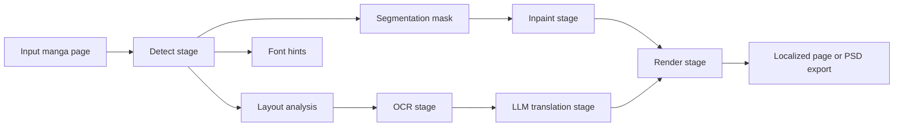

# How Koharu Works

Koharu is built around a page pipeline for manga translation. The user-facing workflow is simple, but the implementation intentionally separates layout, segmentation, OCR, inpainting, translation, and rendering into different stages.

## The pipeline at a glance

At the public pipeline level, Koharu runs:

1. `Detect`
2. `OCR`
3. `Inpaint`
4. `LLM Generate`
5. `Render`

The important implementation detail is that `Detect` is already a multi-model stage:

- `PP-DocLayoutV3` finds text-like layout regions and reading order.
- `comic-text-detector` produces a per-pixel text probability map.
- `YuzuMarker.FontDetection` estimates font and color hints for later rendering.

That split is why Koharu can use one model to decide where text belongs on the page and another to decide which exact pixels should be removed.

## What each stage produces

| Stage | Main models | Main output |
| --- | --- | --- |
| Detect | `PP-DocLayoutV3`, `comic-text-detector`, `YuzuMarker.FontDetection` | text blocks, segmentation mask, font hints |
| OCR | `PaddleOCR-VL-1.5` | recognized source text for each block |
| Inpaint | `lama-manga` | page with original text removed |
| LLM Generate | local GGUF LLM or remote provider | translated text |
| Render | Koharu renderer | final localized page or export |

## Why the stages are separate

Manga pages are harder than plain document OCR:

- speech bubbles are irregular and often curved
- Japanese text may be vertical while captions or SFX may be horizontal
- text can overlap artwork, screentones, speed lines, and panel borders
- reading order is part of the page structure, not just the raw pixels

Because of that, one model is usually not enough. Koharu first estimates layout, then runs OCR on cropped regions, then uses a segmentation mask for cleanup, and only then asks an LLM to translate the text.

## The implementation shape

In source terms, the pipeline entrypoint runs in `koharu/src/pipeline/runner.rs`, while the vision stack is coordinated in `koharu-ml/src/facade.rs`.

Some implementation details that matter:

- the detect stage uses `PP-DocLayoutV3` first and converts text-like layout labels into `TextBlock` objects
- overlapping boxes are deduplicated before OCR
- text direction is inferred from region aspect ratio so vertical manga text can be handled earlier
- OCR runs on cropped text regions, not on the full page
- inpainting consumes the current segmentation mask, not just a rectangular box
- when you choose a remote LLM provider, Koharu sends OCR text for translation, not the full page image

## Why the stack matters

Koharu uses:

- [candle](https://github.com/huggingface/candle) for high-performance inference
- [llama.cpp](https://github.com/ggml-org/llama.cpp) for local LLM inference
- [Tauri](https://github.com/tauri-apps/tauri) for the desktop app shell
- Rust across the stack for performance and memory safety

## Local-first design

By default, Koharu runs:

- vision models locally
- local LLMs locally

If you configure a remote LLM provider, Koharu sends only the text selected for translation to that provider.

## Want the deep technical version?

See [Technical Deep Dive](technical-deep-dive.md) for model types, segmentation mask theory, FFT-based inpainting, and background references to Wikipedia diagrams plus official model cards. See [Text Rendering and Vertical CJK Layout](text-rendering-and-vertical-cjk-layout.md) for the renderer internals, vertical writing-mode behavior, and current layout limits.
