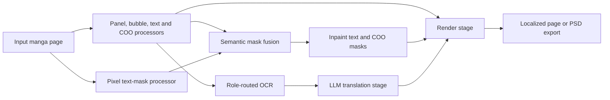

# How Koharu Works

Koharu is built around a staged page pipeline for manga translation. The editor presents that pipeline as a simple workflow, but the implementation keeps detection, segmentation, OCR, inpainting, translation, and rendering separate because each stage produces different data and fails in different ways.

## The pipeline at a glance

The editor still presents familiar phases:

1. `Detection`
2. `Segmentation`
3. `OCR`
4. `Translation`
5. `Typography`
6. `Inpainting`

Rendering consumes those artifacts after the pipeline phases finish.

The important implementation detail is that a phase can contain several named processors:

- `PPDocLayoutV3` finds ordinary text without relying on the fine-tuned YOLO text classes.
- `KoharuYolo26s` finds panels, bubbles, text layout, and COO regions.
- `MangaTextMask` produces a high-resolution per-pixel text candidate.
- `ComicOnomatopoeia` detects, recognizes, and verifies COO independently.
- `MaskFusion` splits the pixel candidate into ordinary-text and COO masks.
- `FontDetector` estimates font and color hints for later rendering.

That split lets Koharu use one model to reason about page structure and another to decide which exact pixels should be removed.

## What each stage produces

| Phase | Main processors | Main output |
| --- | --- | --- |
| Detect | `PPDocLayoutV3`, `KoharuYolo26s`, `ComicOnomatopoeia` | linked panel, bubble, ordinary-text, and COO instances |
| Segment | `MangaTextMask`, `KoharuYolo26s`, `MaskFusion` | separate ordinary-text, COO, and bubble masks |
| OCR | `PaddleOCR-VL-1.6`, COO recognizer/verifier | source text routed by semantic role |
| Inpaint | `LaMa` by default | page with ordinary text and COO removed |
| LLM Generate | local GGUF LLM or remote provider | translated text |
| Render | Koharu renderer | final localized page or export |

## Why the phases are separate

Manga pages are much harder than ordinary document OCR:

- speech bubbles are irregular and often curved
- Japanese text may be vertical while captions or SFX may be horizontal
- text can overlap artwork, screentones, speed lines, and panel borders
- reading order is part of the page structure, not just the raw pixels

Because of that, a single model is usually not enough. Koharu first finds text blocks and bubble regions, then runs OCR on cropped regions, then uses a segmentation mask for cleanup, and only after that asks an LLM to translate the text.

## The implementation shape

In the source tree, the processing phases, execution driver, and built-in processors live in `koharu-pipeline`; runtime settings live in `koharu-config`.

The runner does not treat phases as a fixed sequential list. Every processor declares typed input and output artifacts. Koharu derives and validates a DAG from those contracts, orders processors that write the same artifact, and runs ready nodes concurrently. A failed node blocks only descendants that require it; independent branches continue.

Some implementation details matter:

- regions retain their model confidence and links to their containing panel and bubble
- ordinary OCR skips COO blocks; the COO recognizer and verifier own those blocks
- OCR runs on cropped text regions, not on the full page
- inpainting consumes the union of the ordinary-text, COO, and brush masks
- when you choose a remote LLM provider, Koharu sends OCR text for translation, not the full page image
- individual processors can be swapped in **Settings > Engines** without changing the rest of the pipeline

## Why the stack matters

Koharu uses:

- [LibTorch](https://pytorch.org/cppdocs/) through Koharu's Torch bindings for vision inference
- [llama.cpp](https://github.com/ggml-org/llama.cpp) for local LLM inference
- [Tauri](https://github.com/tauri-apps/tauri) for the desktop app shell
- Rust across the stack for performance and memory safety

## Local-first design

By default, Koharu runs:

- vision models locally
- local LLMs locally

If you configure a remote LLM provider, Koharu sends only the OCR text selected for translation to that provider.

## Want the deep technical version?

See [Technical Deep Dive](technical-deep-dive.md) for model types, segmentation-mask behavior, AOT inpainting, and upstream model references. See [Text Rendering and Vertical CJK Layout](text-rendering-and-vertical-cjk-layout.md) for renderer internals, vertical writing-mode behavior, and current layout limits.

