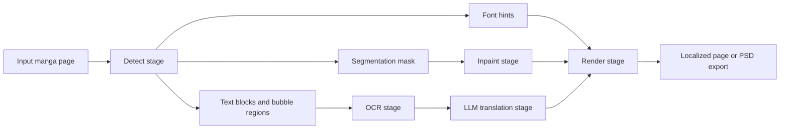

# How Koharu Works

Koharu is built around a staged page pipeline for manga translation. The editor presents that pipeline as a simple workflow, but the implementation keeps detection, segmentation, OCR, inpainting, translation, and rendering separate because each stage produces different data and fails in different ways.

## The pipeline at a glance

At the public pipeline level, Koharu runs:

1. `Detect`
2. `OCR`
3. `Inpaint`
4. `LLM Generate`
5. `Render`

The important implementation detail is that `Detect` is already a multi-model stage:

- `comic-text-bubble-detector` finds text blocks and speech bubble regions.
- `comic-text-detector-seg` produces a per-pixel text probability map that becomes the cleanup mask.
- `YuzuMarker.FontDetection` estimates font and color hints for later rendering.

That split lets Koharu use one model to reason about page structure and another to decide which exact pixels should be removed.

## What each stage produces

| Stage | Main models | Main output |
| --- | --- | --- |
| Detect | `comic-text-bubble-detector`, `comic-text-detector-seg`, `YuzuMarker.FontDetection` | text blocks, bubble regions, segmentation mask, font hints |
| OCR | `PaddleOCR-VL-1.5` | recognized source text for each block |
| Inpaint | `aot-inpainting` | page with original text removed |
| LLM Generate | local GGUF LLM or remote provider | translated text |
| Render | Koharu renderer | final localized page or export |

## Why the stages are separate

Manga pages are much harder than ordinary document OCR:

- speech bubbles are irregular and often curved
- Japanese text may be vertical while captions or SFX may be horizontal
- text can overlap artwork, screentones, speed lines, and panel borders
- reading order is part of the page structure, not just the raw pixels

Because of that, a single model is usually not enough. Koharu first finds text blocks and bubble regions, then runs OCR on cropped regions, then uses a segmentation mask for cleanup, and only after that asks an LLM to translate the text.

## The implementation shape

In the source tree, the engine registry and pipeline execution live in `koharu-app/src/engine.rs`, while default engine selection lives in `koharu-app/src/config.rs`.

Some implementation details matter:

- the default detect engine is `comic-text-bubble-detector`, which writes `TextBlock` values and bubble regions in one pass
- `comic-text-detector-seg` runs after text blocks exist and stores the final cleanup mask as `doc.segment`
- OCR runs on cropped text regions, not on the full page
- inpainting consumes the current segmentation mask, not just a rectangular box
- when you choose a remote LLM provider, Koharu sends OCR text for translation, not the full page image
- individual stages can be swapped in **Settings > Engines** without changing the rest of the pipeline

## Why the stack matters

Koharu uses:

- [candle](https://github.com/huggingface/candle) for high-performance inference
- [llama.cpp](https://github.com/ggml-org/llama.cpp) for local LLM inference
- [Tauri](https://github.com/tauri-apps/tauri) for the desktop app shell
- Rust across the stack for performance and memory safety

## Local-first design

By default, Koharu runs:

- vision models locally
- local LLMs locally

If you configure a remote LLM provider, Koharu sends only the OCR text selected for translation to that provider.

## Want the deep technical version?

See [Technical Deep Dive](technical-deep-dive.md) for model types, segmentation-mask behavior, AOT inpainting, and upstream model references. See [Text Rendering and Vertical CJK Layout](text-rendering-and-vertical-cjk-layout.md) for renderer internals, vertical writing-mode behavior, and current layout limits.

