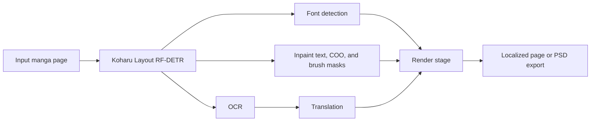

# How Koharu Works

Koharu is built around a five-phase page-processing pipeline. Detection, OCR, translation, typography, and inpainting stay separate because each phase performs different work and fails in different ways. Rendering consumes the resulting scene data after the pipeline.

## The pipeline at a glance

```mermaid
flowchart LR
    A[Input manga page] --> B[Koharu Layout RF-DETR]
    B --> C[OCR]
    B --> D[Inpaint text, COO, and brush masks]
    B --> T[Font detection]
    C --> E[Translation]
    T --> F
    D --> F[Render stage]
    E --> F
    F --> G[Localized page or PSD export]
```

The pipeline has five phases:

1. `Detection`
2. `OCR`
3. `Translation`
4. `Typography`
5. `Inpainting`

Rendering consumes the scene after the pipeline phases finish.

`KoharuLayoutRFDetrSeg2XL` is the sole detection processor. A single inference finds panels, bubbles, ordinary text, and onomatopoeia while producing their pixel masks. OCR and inpainting each select one processor from their respective model families.

## What each stage produces

| Phase | Main processors | Main output |
| --- | --- | --- |
| Detect | `KoharuLayoutRFDetrSeg2XL` | linked panel, bubble, text, and onomatopoeia instances plus final masks |
| OCR | `PaddleOCR-VL-1.6` | source text for detected text regions |
| Translation | local GGUF LLM or remote provider | translated text |
| Typography | `FontDetector` | detected text color and typography metadata |
| Inpaint | `LaMa` by default | page cleaned with the available text, COO, and brush masks |
| Render | Koharu renderer | final localized page or export |

## Why the phases are separate

Manga pages are much harder than ordinary document OCR:

- speech bubbles are irregular and often curved
- Japanese text may be vertical while captions or SFX may be horizontal
- text can overlap artwork, screentones, speed lines, and panel borders
- reading order is part of the page structure, not just the raw pixels

Koharu first finds text blocks and bubble regions together with their masks, then runs OCR on cropped regions, and uses the masks for cleanup before translation and rendering.

## The implementation shape

In the source tree, the processing phases, execution driver, and built-in processors live in `koharu-pipeline`; runtime settings live in `koharu-config`.

The runner does not infer dependencies from phase order. It stores the five processors in a `petgraph` graph with four fixed edges: detection to OCR, typography, and inpainting, plus OCR to translation. OCR, typography, and inpainting can therefore run concurrently after detection. Processors read the immutable scene context directly and return scene commands; they do not declare input or output ports.

Some implementation details matter:

- regions retain their model confidence and links to their containing panel and bubble
- OCR runs on cropped text regions, not on the full page
- inpainting consumes the union of the ordinary-text, COO, and brush masks
- when you choose a remote LLM provider, Koharu sends OCR text for translation, not the full page image
- OCR and inpainting processors can be swapped in **Settings > Pipeline** without changing the graph

## Why the stack matters

Koharu uses:

- [LibTorch](https://pytorch.org/cppdocs/) through Koharu's Torch bindings for vision inference
- [llama.cpp](https://github.com/ggml-org/llama.cpp) for local LLM inference
- [Tauri](https://github.com/tauri-apps/tauri) for the desktop app shell
- Rust across the stack for performance and memory safety

## Local-first design

By default, Koharu runs:

- vision models locally
- local LLMs locally

If you configure a remote LLM provider, Koharu sends only the OCR text selected for translation to that provider.

## Want the deep technical version?

See [Technical Deep Dive](technical-deep-dive.md) for model types, segmentation-mask behavior, AOT inpainting, and upstream model references. See [Text Rendering and Vertical CJK Layout](text-rendering-and-vertical-cjk-layout.md) for renderer internals, vertical writing-mode behavior, and current layout limits.

