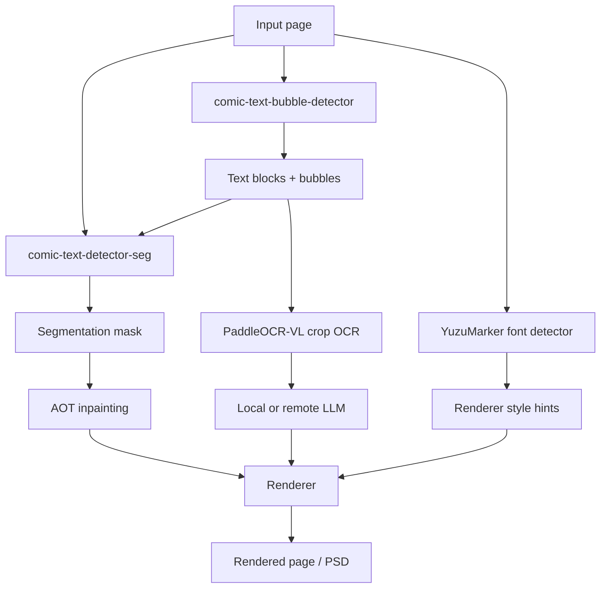
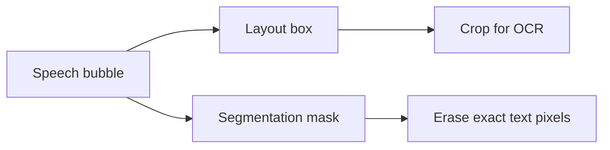

# Technical Deep Dive

This page explains the technical side of Koharu's manga pipeline: what each model does, how the stages fit together, and why text and bubble detection, segmentation masks, OCR, inpainting, and translation are handled separately.

## The page pipeline in implementation terms

At the code level, the public pipeline steps are `Detect -> OCR -> Inpaint -> LLM Generate -> Render`, but the detect stage is already doing three distinct jobs:

- text and bubble detection
- text foreground segmentation
- font and color estimation

That design is deliberate. A manga translation tool needs both page structure and pixel precision.

## Model types at a glance

| Component | Default model | Model type | Main job in Koharu |
| --- | --- | --- | --- |
| Text and bubble detection | [comic-text-bubble-detector](https://huggingface.co/ogkalu/comic-text-and-bubble-detector) | object detector | find text blocks and speech bubble regions |
| Segmentation | [comic-text-detector](https://github.com/dmMaze/comic-text-detector) | text segmentation network | produce a dense text mask for cleanup |
| OCR | [PaddleOCR-VL-1.5](https://huggingface.co/PaddlePaddle/PaddleOCR-VL-1.5) | vision-language model | read cropped text regions into Unicode text |
| Inpainting | [aot-inpainting](https://huggingface.co/mayocream/aot-inpainting) / [manga-image-translator](https://github.com/zyddnys/manga-image-translator) | image inpainting network | fill masked regions after text removal |
| Font hints | [YuzuMarker.FontDetection](https://huggingface.co/fffonion/yuzumarker-font-detection) | image classifier / regressor | estimate font family, colors, and stroke hints |
| Translation | local GGUF model via [llama.cpp](https://github.com/ggml-org/llama.cpp) or remote API | decoder-only LLM in most local setups | translate OCR text into the target language |

Optional built-in alternatives remain available. The main ones are [PP-DocLayoutV3](https://huggingface.co/PaddlePaddle/PP-DocLayoutV3_safetensors) as an alternative detector and layout-analysis engine, [speech-bubble-segmentation](https://huggingface.co/mayocream/speech-bubble-segmentation) as a dedicated bubble detector, and [lama-manga](https://huggingface.co/mayocream/lama-manga) as an alternative inpainter.

## Why text and bubble detection matters on manga pages

Detection is not just "find boxes around text". On manga pages it has to answer several structural questions:

- which regions are text-like at all
- where speech bubbles are
- whether a block is tall enough to behave like vertical text
- which boxes should be deduplicated before OCR
- which regions should become editable `TextBlock` records

This matters because manga is visually dense:

- speech bubbles are often curved or skewed
- text may sit on top of screentones and action lines
- vertical Japanese and horizontal Latin text can coexist on the same page
- the region that should be read is not always the same shape as the pixels that should be erased

Koharu uses the detector output to create `TextBlock` records first, then uses those blocks to drive OCR and later rendering. Bubble regions are kept as separate geometry so the UI and later tooling can still reason about the speech-balloon area.

In the current implementation, the default detect stage:

- runs the Candle port of `ogkalu/comic-text-and-bubble-detector`
- converts text detections into `TextBlock` values
- converts bubble detections into `BubbleRegion` values
- sorts text blocks into manga reading order before OCR

If you prefer a document-layout-style detector, `PP-DocLayoutV3` is still available as an alternative engine. It is just no longer the default.

## What a segmentation mask is

A segmentation mask is an image-sized map where each pixel says whether it belongs to a target class. In Koharu's case, the target class is effectively "text foreground that should later be removed during cleanup".

This is different from a bounding box:

| Representation | What it means | Best used for |
| --- | --- | --- |
| Bounding box | coarse rectangular region | OCR crop selection, ordering, UI editing |
| Polygon | tighter geometric outline | line-level geometry |
| Segmentation mask | per-pixel foreground map | inpainting and precise cleanup |

In Koharu, the segmentation path is intentionally separate from layout:

- `comic-text-detector` produces a grayscale probability map
- Koharu thresholds and dilates that map with lightweight post-processing
- the resulting binary mask becomes `doc.segment`
- `aot-inpainting` then uses `doc.segment` as the erase and fill mask for inpainting

The cleanup step still matters because raw segmentation probabilities are usually soft and noisy. Koharu thresholds the prediction and dilates the final binary mask so the cleanup covers text edges and outlines instead of leaving halos behind.

## How the vision models work in theory

### Joint detection: text blocks and bubble regions in one pass

[ogkalu/comic-text-and-bubble-detector](https://huggingface.co/ogkalu/comic-text-and-bubble-detector) is the default detector because it directly predicts the two region types the rest of the pipeline cares about most:

- text-like regions that should become `TextBlock`s
- speech-bubble regions that should stay available to the editor and downstream tooling

Koharu's Candle port maps those detections into document data structures and then sorts the text blocks into manga reading order before OCR. Conceptually, this is closer to page object detection than to OCR itself.

### Segmentation: dense per-pixel text prediction

Koharu's `comic-text-detector` path is a segmentation-first design. The Rust port loads:

- a YOLOv5-style backbone
- a U-Net decoder for mask prediction
- an optional DBNet head for full detection mode

The default page pipeline uses the segmentation-only path because Koharu already gets text blocks from `comic-text-bubble-detector`. That means Koharu combines:

- one model that is good at page-level region detection
- one model that is good at pixel-level text foreground

This is a better fit for cleanup than relying on boxes alone.

### OCR: multimodal decoding from image crops to text tokens

[PaddleOCR-VL](https://huggingface.co/docs/transformers/en/model_doc/paddleocr_vl) is a compact vision-language model. The official architecture description says it combines:

- a NaViT-style dynamic-resolution visual encoder
- the ERNIE-4.5-0.3B language model

In theory, OCR here works like a multimodal sequence generation problem:

1. the image crop is encoded into visual tokens
2. a text prompt such as `OCR:` conditions the task
3. the decoder autoregressively emits the recognized text tokens

Koharu's implementation follows that pattern closely:

- it loads `PaddleOCR-VL-1.5.gguf` and a separate multimodal projector
- it injects the image through the llama.cpp multimodal path
- it prompts with `OCR:`
- it greedily decodes text for each crop

So OCR in Koharu is not a classic CTC-only recognizer. It is a small document-oriented VLM being used in a tightly scoped OCR task.

### Inpainting: why the default is now AOT

The default inpainter is the AOT model from [manga-image-translator](https://github.com/zyddnys/manga-image-translator), exposed in Koharu as `aot-inpainting`. It is a masked-image inpainting network built around gated convolutions and repeated context-mixing blocks with multiple dilation rates.

The important intuition is:

- text removal needs more than a rectangular crop fill
- the model needs both local edge detail and wider context from the bubble or background
- repeated multi-dilation blocks are a practical way to mix that context without changing the rest of the pipeline contract

Koharu's Candle port follows the upstream inference shape closely:

1. resize large pages down to a configurable max side
2. pad the working image to a multiple-of-8 shape
3. feed the masked RGB image plus a binary text mask into the network
4. composite the predicted pixels back into the original image size

`lama-manga` is still available as an alternative engine if you want LaMa's Fourier-based behavior, but it is no longer the default.

## Local LLMs and model type

Koharu's local translation path uses GGUF models through `llama.cpp`. In practice, these are usually quantized decoder-only transformers.

The theory is standard modern LLM inference:

- tokenize the OCR text
- run masked self-attention over the growing token sequence
- predict the next token repeatedly until the output is complete

The practical trade-off is also standard:

- larger models usually translate better
- smaller quantized models use less VRAM and RAM
- remote providers trade local privacy for easier access to larger hosted models

Koharu keeps the image understanding steps local even when you choose a remote text-generation provider. The remote side only needs the OCR text.

## Koharu-specific implementation notes

Some details that are easy to miss if you only read the high-level docs:

- the default detect stage is `comic-text-bubble-detector`, not `PP-DocLayoutV3`
- `comic-text-detector-seg` still loads the segmentation-only `comic-text-detector` path for `doc.segment`
- the segmentation mask is currently built from thresholding plus dilation, not the older block-aware refinement path
- OCR runs on cropped text-block images, not the original whole page
- the OCR wrapper uses the multimodal llama.cpp path and the task prompt `OCR:`
- inpainting consumes `doc.segment`, so bad masks lead directly to bad cleanup
- the default inpainter is `aot-inpainting`, while `lama-manga` remains selectable as an alternative
- font prediction is normalized before rendering so near-black and near-white colors snap to cleaner values

## Recommended reading

### Official model and project references

- [comic-text-and-bubble-detector model card](https://huggingface.co/ogkalu/comic-text-and-bubble-detector)
- [PaddleOCR-VL-1.5 model card](https://huggingface.co/PaddlePaddle/PaddleOCR-VL-1.5)
- [PaddleOCR-VL architecture docs in Hugging Face Transformers](https://huggingface.co/docs/transformers/en/model_doc/paddleocr_vl)
- [comic-text-detector repository](https://github.com/dmMaze/comic-text-detector)
- [manga-image-translator repository](https://github.com/zyddnys/manga-image-translator)
- [YuzuMarker.FontDetection model card](https://huggingface.co/fffonion/yuzumarker-font-detection)
- [PP-DocLayoutV3 model card](https://huggingface.co/PaddlePaddle/PP-DocLayoutV3)
- [LaMa repository](https://github.com/advimman/lama)
- [llama.cpp](https://github.com/ggml-org/llama.cpp)

### Background theory and Wikipedia diagrams

These pages are useful when you want the general theory and the overview diagrams before diving into model cards:

- [Fourier transform](https://en.wikipedia.org/wiki/Fourier_transform)
- [Image segmentation](https://en.wikipedia.org/wiki/Image_segmentation)
- [Optical character recognition](https://en.wikipedia.org/wiki/Optical_character_recognition)
- [Transformer (deep learning architecture)](https://en.wikipedia.org/wiki/Transformer_(deep_learning_architecture))
- [Object detection](https://en.wikipedia.org/wiki/Object_detection)
- [Inpainting](https://en.wikipedia.org/wiki/Inpainting)

Those Wikipedia links are background references. For Koharu-specific behavior and the actual model architecture choices, prefer the official model cards and the source tree.
