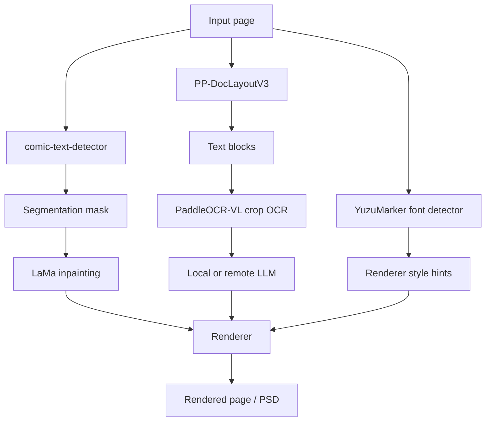
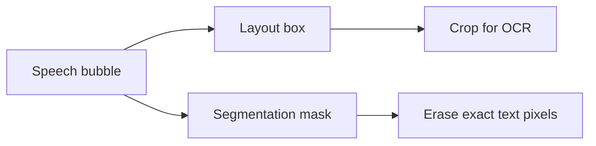

# Technical Deep Dive

This page explains the technical side of Koharu's manga pipeline: what each model does, how the stages fit together, and why layout analysis, segmentation masks, OCR, inpainting, and translation are handled separately.

## The page pipeline in implementation terms

At the code level, the public pipeline steps are `Detect -> OCR -> Inpaint -> LLM Generate -> Render`, but the detect stage is already doing three distinct jobs:

- page layout analysis
- text foreground segmentation
- font and color estimation

That design is deliberate. A manga translation tool needs both page structure and pixel precision.

## Model types at a glance

| Component | Default model | Model type | Main job in Koharu |
| --- | --- | --- | --- |
| Layout analysis | [PP-DocLayoutV3](https://huggingface.co/PaddlePaddle/PP-DocLayoutV3_safetensors) | document layout detector | find text-like regions, labels, confidence, and reading order |
| Segmentation | [comic-text-detector](https://github.com/dmMaze/comic-text-detector) | text segmentation network | produce a dense text mask for cleanup |
| OCR | [PaddleOCR-VL-1.5](https://huggingface.co/PaddlePaddle/PaddleOCR-VL-1.5) | vision-language model | read cropped text regions into Unicode text |
| Inpainting | [lama-manga](https://huggingface.co/mayocream/lama-manga) / [LaMa](https://github.com/advimman/lama) | image inpainting network | fill masked regions after text removal |
| Font hints | [YuzuMarker.FontDetection](https://huggingface.co/fffonion/yuzumarker-font-detection) | image classifier / regressor | estimate font family, colors, and stroke hints |
| Translation | local GGUF model via [llama.cpp](https://github.com/ggml-org/llama.cpp) or remote API | decoder-only LLM in most local setups | translate OCR text into the target language |

## Why layout analysis matters on manga pages

Layout analysis is not just "find boxes around text". On manga pages it has to answer several structural questions:

- which regions are text-like at all
- where the reading order probably is
- whether a block is tall enough to behave like vertical text
- which boxes should be deduplicated before OCR
- which parts of the page are captions, bubble text, titles, or other layout categories

This matters because manga is visually dense:

- speech bubbles are often curved or skewed
- text may sit on top of screentones and action lines
- vertical Japanese and horizontal Latin text can coexist on the same page
- the region that should be read is not always the same shape as the pixels that should be erased

Koharu uses layout output to create `TextBlock` records first, then uses those blocks to drive OCR and later rendering.

In the current implementation, the layout stage:

- runs `PP-DocLayoutV3::inference_one_fast(...)`
- keeps regions whose labels look text-like
- converts them into `TextBlock` values
- deduplicates heavily overlapping regions
- infers vertical vs horizontal source direction from aspect ratio

So layout analysis is the structural backbone of the rest of the pipeline.

## What a segmentation mask is

A segmentation mask is an image-sized map where each pixel says whether it belongs to a target class. In Koharu's case, the target class is effectively "text foreground that should later be removed during cleanup".

This is different from a bounding box:

| Representation | What it means | Best used for |
| --- | --- | --- |
| Bounding box | coarse rectangular region | OCR crop selection, ordering, UI editing |
| Polygon | tighter geometric outline | line-level geometry |
| Segmentation mask | per-pixel foreground map | inpainting and precise cleanup |

In Koharu, the segmentation path is intentionally separate from layout:

- `comic-text-detector` produces a grayscale probability map
- Koharu refines that map with post-processing
- the refined result becomes `doc.segment`
- LaMa then uses `doc.segment` as the erase and fill mask for inpainting

The refinement step matters because raw segmentation probabilities are usually soft and noisy. Koharu thresholds the prediction, tries block-aware refinement, and dilates the final binary mask so the cleanup covers text edges and outlines instead of leaving halos behind.

## How the vision models work in theory

### Layout analysis: detector plus reading-order reasoning

[PP-DocLayoutV3](https://huggingface.co/PaddlePaddle/PP-DocLayoutV3) is a layout model built for document parsing under skew, warping, and other non-planar distortions. Its model card highlights two properties that are especially relevant to manga-style pages:

- it predicts multi-point geometry instead of only axis-aligned two-point boxes
- it predicts logical reading order in the same forward pass

Koharu's Rust port mirrors that shape: the `pp_doclayout_v3` module contains an `HGNetV2` backbone plus attention-based encoder and decoder blocks, and the inference result exposes `label`, `score`, `bbox`, `polygon_points`, and `order`.

Conceptually, this is closer to object detection plus layout parsing than to OCR itself.

### Segmentation: dense per-pixel text prediction

Koharu's `comic-text-detector` path is a segmentation-first design. The Rust port loads:

- a YOLOv5-style backbone
- a U-Net decoder for mask prediction
- an optional DBNet head for full detection mode

The default page pipeline uses the segmentation-only path because Koharu already gets layout boxes from `PP-DocLayoutV3`. That means Koharu combines:

- one model that is good at page structure
- one model that is good at pixel-level text foreground

This is a better fit for cleanup than relying on boxes alone.

### OCR: multimodal decoding from image crops to text tokens

[PaddleOCR-VL](https://huggingface.co/docs/transformers/en/model_doc/paddleocr_vl) is a compact vision-language model. The official architecture description says it combines:

- a NaViT-style dynamic-resolution visual encoder
- the ERNIE-4.5-0.3B language model

In theory, OCR here works like a multimodal sequence generation problem:

1. the image crop is encoded into visual tokens
2. a text prompt such as `OCR:` conditions the task
3. the decoder autoregressively emits the recognized text tokens

Koharu's implementation follows that pattern closely:

- it loads `PaddleOCR-VL-1.5.gguf` and a separate multimodal projector
- it injects the image through the llama.cpp multimodal path
- it prompts with `OCR:`
- it greedily decodes text for each crop

So OCR in Koharu is not a classic CTC-only recognizer. It is a small document-oriented VLM being used in a tightly scoped OCR task.

### Inpainting: why LaMa uses Fourier convolutions

[LaMa](https://github.com/advimman/lama) is an inpainting model designed for large masked regions. Its paper title is explicit about the key idea: *Resolution-robust Large Mask Inpainting with Fourier Convolutions*.

The important intuition is:

- ordinary convolutions are local
- text removal often needs long-range context from the rest of the bubble or background
- frequency-domain operations can capture wider context efficiently

This is where FFT comes in.

#### What FFT means here

FFT stands for **Fast Fourier Transform**. It is a fast algorithm for moving between:

- the spatial domain, where pixels live
- the frequency domain, where repeating patterns and large-scale structure are easier to manipulate

In Koharu's LaMa port, the `FourierUnit` does exactly that:

1. apply `rfft2` to feature maps
2. process the real and imaginary channels with learned `1x1` convolutions
3. apply `irfft2` to return to image space

Koharu even implements custom `rfft2` and `irfft2` ops for CPU, CUDA, and Metal backends so the same spectral block can run across hardware targets.

For manga cleanup, this matters because the missing region is often not just a tiny scratch. It may be an entire speech bubble interior with gradients, screentones, and inked edges. Fourier-style global mixing helps the model preserve larger structures while filling the hole.

## Local LLMs and model type

Koharu's local translation path uses GGUF models through `llama.cpp`. In practice, these are usually quantized decoder-only transformers.

The theory is standard modern LLM inference:

- tokenize the OCR text
- run masked self-attention over the growing token sequence
- predict the next token repeatedly until the output is complete

The practical trade-off is also standard:

- larger models usually translate better
- smaller quantized models use less VRAM and RAM
- remote providers trade local privacy for easier access to larger hosted models

Koharu keeps the image understanding steps local even when you choose a remote text-generation provider. The remote side only needs the OCR text.

## Koharu-specific implementation notes

Some details that are easy to miss if you only read the high-level docs:

- the detect stage currently loads `ComicTextDetector::load_segmentation_only(...)`, not the full DBNet-backed detection mode
- the segmentation mask is refined against the current detected text blocks before inpainting
- OCR runs on cropped text-block images, not the original whole page
- the OCR wrapper uses the multimodal llama.cpp path and the task prompt `OCR:`
- inpainting consumes `doc.segment`, so bad masks lead directly to bad cleanup
- font prediction is normalized before rendering so near-black and near-white colors snap to cleaner values

## Recommended reading

### Official model and project references

- [PP-DocLayoutV3 model card](https://huggingface.co/PaddlePaddle/PP-DocLayoutV3)
- [PaddleOCR-VL-1.5 model card](https://huggingface.co/PaddlePaddle/PaddleOCR-VL-1.5)
- [PaddleOCR-VL architecture docs in Hugging Face Transformers](https://huggingface.co/docs/transformers/en/model_doc/paddleocr_vl)
- [comic-text-detector repository](https://github.com/dmMaze/comic-text-detector)
- [LaMa repository](https://github.com/advimman/lama)
- [llama.cpp](https://github.com/ggml-org/llama.cpp)

### Background theory and Wikipedia diagrams

These pages are useful when you want the general theory and the overview diagrams before diving into model cards:

- [Fourier transform](https://en.wikipedia.org/wiki/Fourier_transform)
- [Image segmentation](https://en.wikipedia.org/wiki/Image_segmentation)
- [Optical character recognition](https://en.wikipedia.org/wiki/Optical_character_recognition)
- [Transformer (deep learning architecture)](https://en.wikipedia.org/wiki/Transformer_(deep_learning_architecture))
- [Object detection](https://en.wikipedia.org/wiki/Object_detection)
- [Inpainting](https://en.wikipedia.org/wiki/Inpainting)

Those Wikipedia links are background references. For Koharu-specific behavior and the actual model architecture choices, prefer the official model cards and the source tree.
