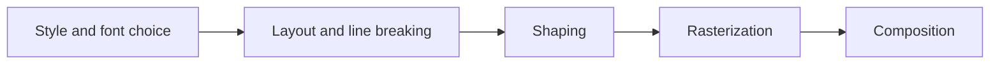
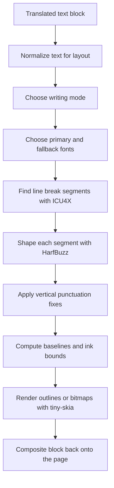

# Text Rendering and Vertical CJK Layout

Text rendering is one of the hardest parts of a manga translator. Detection, OCR, and inpainting decide what should happen to the page, but the renderer decides whether the result still looks like a manga page instead of a debug overlay.

A good outside reference here is Aria Desires's [Text Rendering Hates You](https://faultlore.com/blah/text-hates-you/). Its main point applies directly to Koharu: text rendering is not a clean linear problem, and there is no universally perfect answer. Layout, shaping, font fallback, rasterization, and composition all push on each other.

Koharu does not try to be a full desktop publishing engine. It tries to be very good at the specific kinds of text layout manga pages need most, especially vertical CJK bubble text.

## Why this problem is hard

The Faultlore article breaks a renderer into a familiar set of stages:

That picture is useful, but in practice the stages do not stay independent:

- you cannot know the final line breaks until you know shaped advances
- you cannot shape reliably without knowing the writing direction and OpenType features
- you cannot pick one font for all text because manga pages mix scripts, symbols, and emoji
- you cannot just draw code points one by one because real text is shaped into glyph runs
- you cannot assume that a bubble's box is the same thing as the renderer's true ink bounds

Vertical manga text makes this harder again:

- columns flow top-to-bottom, but the columns themselves flow right-to-left
- punctuation often needs vertical alternates or recentering
- some fonts support proper vertical forms and some do not
- mixed Japanese, Chinese, Latin, numbers, symbols, and emoji often appear in the same block

## What Koharu actually does

At the implementation level, the renderer lives in the `koharu-renderer` crate and the main orchestration happens in `koharu-app/src/renderer.rs`, `src/layout.rs`, `src/shape.rs`, `src/segment.rs`, and `src/renderer.rs`.

The pipeline for one translated `TextBlock` is roughly:

In concrete terms:

- `LineBreaker` uses ICU4X line segmentation
- `TextShaper` uses HarfBuzz through `harfrust`
- `TextLayout` turns shaped runs into lines or vertical columns
- `TinySkiaRenderer` rasterizes outlines with `skrifa` and falls back to `fontdue` bitmaps when needed
- `Renderer::render_text_block` glues that together with font hints, stroke choices, and page placement

## How Koharu chooses vertical layout

Koharu does not blindly force all CJK text into vertical mode. The current heuristic in `text/script.rs` is:

- if the translation contains CJK text and the block is taller than it is wide, use `VerticalRl`
- otherwise, keep the block horizontal

That means vertical layout is tied to both:

- script detection
- the geometry of the detected or user-adjusted text box

This is simple on purpose. It matches a large share of manga bubble text, and it avoids turning every mixed-script caption into vertical text just because it contains one Japanese character.

It is also a heuristic, not a universal writing-mode engine. That matters for edge cases and is one of the current limits of the renderer.

## How vertical CJK is implemented

### 1. Writing mode becomes a real shaping direction

`WritingMode::VerticalRl` is not just a final canvas rotation trick.

Koharu converts it into a top-to-bottom shaping direction before HarfBuzz runs. That means the font and shaping engine can produce vertical advances and vertical glyph forms instead of pretending horizontal text was rotated after the fact.

### 2. Vertical OpenType features are enabled

When Koharu shapes vertical text, it enables the OpenType features:

- `vert`
- `vrt2`

These are the standard vertical alternates used by fonts that actually support vertical writing. This is one of the biggest reasons the renderer can produce convincing vertical CJK layout instead of looking like rotated horizontal text.

If the font has proper vertical glyph substitutions, Koharu can use them. If the font does not, the result degrades to whatever the font provides.

### 3. Lines become columns

In vertical mode, the layout logic flips the main extent:

- `max_height` is the thing that limits a column
- the per-column advance is read from `y_advance`
- each new line becomes a new column

The baselines are then placed so that:

- glyphs advance downward within a column
- the first column starts on the right
- additional columns step leftward by the line height

That is the expected `vertical-rl` flow used in traditional Japanese manga bubbles.

### 4. Fullwidth punctuation is recentered

Vertical CJK layout looks wrong very quickly if punctuation is left with naive horizontal centering. Koharu has explicit handling for fullwidth punctuation and recenters those glyphs from their actual font bounds.

This covers cases such as:

- ideographic comma and full stop
- fullwidth punctuation blocks
- brackets and corner marks
- middle dots and similar marks

This is not a cosmetic extra. It is one of the reasons the current vertical path looks much more deliberate than a generic text renderer.

### 5. Emphasis punctuation is normalized

The layout code also normalizes emphasis-mark pairs for vertical text. For example, repeated or paired `!` and `?` marks can be collapsed into the corresponding combined Unicode forms before shaping.

That helps preserve the vertical look readers expect from manga punctuation instead of stacking awkward horizontal punctuation choices into a tall narrow column.

### 6. Ink bounds are measured tightly

After layout, Koharu computes a tight ink bounding box from per-glyph metrics and then translates the baselines so the true ink origin starts at `(0, 0)`.

This is important because:

- font metrics alone are not enough to prevent clipping
- vertical punctuation and alternate glyph forms can have surprising extents
- outline and bitmap glyphs need to land in the same final surface reliably

In practice, this bounds pass is one of the pieces that makes the renderer feel stable instead of constantly shaving off the top, bottom, or right edge of the text.

## Why the output is good on manga bubbles

Koharu gets several high-value things right for the common manga case:

- it uses real shaping, not character-by-character drawing
- it enables vertical font features instead of rotating finished horizontal text
- it supports right-to-left column flow for vertical CJK
- it uses ICU4X line segmentation rather than a naive split-by-character loop
- it falls back across fonts when one face is missing a symbol or emoji
- it centers fullwidth punctuation in vertical mode
- it has tests specifically checking vertical flow direction and vertical Chinese and Japanese output

That combination is why the renderer can produce vertical CJK text that looks intentional and readable instead of merely "supported".

## How perfect is it?

It is strong for the common manga cases. It is not a perfect Japanese typesetting engine.

That distinction matters.

Koharu is best understood as:

- much better than rotating horizontal text
- good at vertical bubble layout with modern CJK fonts
- deliberately tuned for practical manga translation work
- still best-effort rather than mathematically or typographically perfect

## Current limits

The codebase is fairly honest about where the renderer is still incomplete.

### Writing mode is heuristic

Vertical mode currently depends on:

- whether the translation contains CJK text
- whether the block is taller than it is wide

That works surprisingly well for bubbles, but it is still a heuristic. Mixed-script captions, sideways notes, and unusual SFX blocks can still need manual correction.

### CJK line breaking still uses default ICU behavior

`segment.rs` explicitly notes a `TODO` for CJK-specific customization. So while ICU4X already gives Koharu a much better base than ad hoc wrapping, it is not yet a manga-specialized kinsoku implementation.

### Font support matters a lot

Vertical alternates only look as good as the chosen font allows. If the system font does not contain proper vertical forms, the renderer cannot invent a full professional CJK font from scratch.

### No full publishing-engine features

Koharu is not trying to do every advanced text feature you would expect from a full composition system. The current renderer is not a full implementation of things such as:

- ruby annotation
- warichu and other advanced Japanese layout features
- per-run mixed styling with complex ligature-aware behavior
- full manual typographic controls for every glyph run

### Translation length still changes layout quality

Even with good shaping, a translation can simply be too long or too awkward for the available bubble. The renderer can fit and align text, but it cannot always turn a bad block geometry or overly verbose translation into perfect lettering.

## Why Koharu does not just rotate text

The cheap solution for vertical text is to lay it out horizontally and rotate the result. Koharu avoids that because the failure modes are obvious:

- punctuation sits incorrectly
- glyph advances are wrong
- column flow feels fake
- fonts cannot apply their vertical alternates
- bounds and clipping become harder to reason about

Koharu instead pushes vertical handling back into the shaping and layout stages. That is the main architectural decision behind its vertical CJK output.

## External reference worth reading

[Text Rendering Hates You](https://faultlore.com/blah/text-hates-you/) is useful because it explains the renderer problem in a language-agnostic way. The specific stack in Koharu is different from a browser engine, but the same core lessons show up here:

- shaping is not optional
- fallback fonts are unavoidable
- layout and shaping depend on each other
- "perfect" text rendering is mostly a story people tell before they implement it

If you want the short version: Koharu's renderer is careful precisely because text rendering really does hate you.

