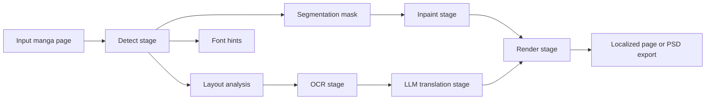

# Koharu の仕組み

Koharu は、漫画翻訳のためのページパイプラインを中心に設計されています。ユーザーから見た操作はシンプルですが、実装ではレイアウト解析、segmentation、OCR、inpainting、翻訳、レンダリングを意図的に別段階に分けています。

## パイプラインの全体像

公開されているパイプライン段階としては、Koharu は次の順で動きます。

1. `Detect`
2. `OCR`
3. `Inpaint`
4. `LLM Generate`
5. `Render`

重要なのは、`Detect` がすでに複数モデルから成る段階だということです。

- `PP-DocLayoutV3` はテキストらしいレイアウト領域と読み順を見つけます
- `comic-text-detector` はピクセル単位のテキスト確率マップを作ります
- `YuzuMarker.FontDetection` は後段のレンダリングに使うフォントや色のヒントを推定します

この分割によって、Koharu は「ページ上のどこにテキストがあるか」を決めるモデルと、「どのピクセルを実際に消すべきか」を決めるモデルを分けて使えます。

## 各段階が出力するもの

| 段階 | 主なモデル | 主な出力 |
| --- | --- | --- |
| Detect | `PP-DocLayoutV3`, `comic-text-detector`, `YuzuMarker.FontDetection` | テキストブロック、segmentation mask、フォントヒント |
| OCR | `PaddleOCR-VL-1.5` | 各ブロックの認識済み元テキスト |
| Inpaint | `lama-manga` | 元の文字を消したページ |
| LLM Generate | ローカル GGUF LLM またはリモートプロバイダ | 翻訳済みテキスト |
| Render | Koharu renderer | 最終的なローカライズ済みページまたは export |

## なぜ段階を分けているのか

漫画ページは、普通の文書 OCR より難しい対象です。

- 吹き出しは不規則で、しばしば曲がっている
- 日本語は縦書き、キャプションや SFX は横書きという混在がある
- テキストが作画、スクリーントーン、スピード線、コマ枠に重なる
- 読み順は単なるピクセル情報ではなく、ページ構造そのものの一部

そのため、1 つのモデルだけでは足りないことが多くなります。Koharu はまずレイアウトを推定し、次に切り出し領域へ OCR をかけ、segmentation mask を使ってクリーンアップし、その後で初めて LLM に翻訳を依頼します。

## 実装の形

ソースコード上では、パイプラインの入口は `koharu-app/src/pipeline.rs` にあり、vision スタックの調整は `koharu-app/src/ml.rs` で行われています。

実装上、重要な点は次の通りです。

- detect 段階では先に `PP-DocLayoutV3` を走らせ、テキストらしいラベルを `TextBlock` に変換する
- 重なりすぎた box は OCR 前に重複除去される
- テキスト方向は領域の縦横比から推定され、縦書き漫画テキストを早い段階で扱える
- OCR はページ全体ではなく、切り出したテキスト領域に対して実行される
- inpainting は単なる矩形ではなく、現在の segmentation mask を使う
- リモート LLM プロバイダを選んだ場合でも、送るのはページ画像ではなく OCR テキスト

## このスタックが重要な理由

Koharu は次を使っています。

- 高性能な推論のための [candle](https://github.com/huggingface/candle)
- ローカル LLM 推論のための [llama.cpp](https://github.com/ggml-org/llama.cpp)
- デスクトップアプリシェルのための [Tauri](https://github.com/tauri-apps/tauri)
- 性能とメモリ安全性のための Rust

## local-first な設計

既定では、Koharu は次をローカルで実行します。

- vision モデル
- ローカル LLM

リモート LLM プロバイダを設定した場合でも、送信されるのは翻訳対象として選ばれたテキストだけです。

## もっと技術寄りの説明が欲しい場合

モデル種別、segmentation mask の理屈、FFT ベースの inpainting、Wikipedia 図表と公式 model card への参照を含む詳細説明は [技術的な詳細解説](technical-deep-dive.md) を参照してください。レンダラ内部、縦書き挙動、現在のレイアウト上の限界については [テキストレンダリングと縦書き CJK レイアウト](text-rendering-and-vertical-cjk-layout.md) にあります。

