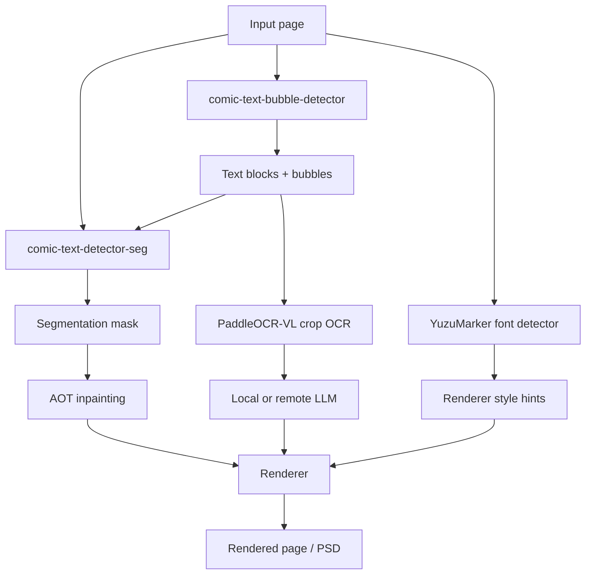
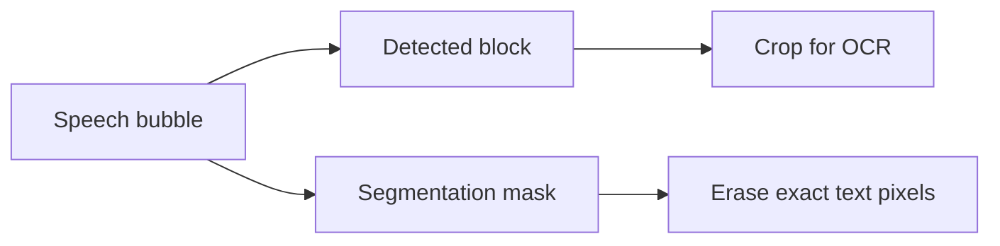

# 技術的な詳細解説

このページでは、Koharu の漫画翻訳パイプラインを技術面から説明します。各モデルが何をしているのか、各段階がどうつながるのか、そしてなぜテキストと吹き出しの検出、segmentation mask、OCR、inpainting、翻訳を分けて扱うのかをまとめます。

## 実装ベースで見たページパイプライン

コード上の公開パイプライン段階は `Detect -> OCR -> Inpaint -> LLM Generate -> Render` ですが、detect 段階の中で既に 3 つの別作業をしています。

- テキストと吹き出しの検出
- テキスト前景の segmentation
- フォントと色の推定

この設計は意図的です。漫画翻訳ツールには、ページ構造の理解とピクセル精度の両方が必要だからです。

## モデル種別の一覧

| コンポーネント | 既定モデル | モデル種別 | Koharu での主な役割 |
| --- | --- | --- | --- |
| テキスト / 吹き出し検出 | [comic-text-bubble-detector](https://huggingface.co/ogkalu/comic-text-and-bubble-detector) | object detector | テキストブロックと吹き出し領域を見つける |
| Segmentation | [comic-text-detector](https://github.com/dmMaze/comic-text-detector) | text segmentation network | クリーンアップ用の dense text mask を作る |
| OCR | [PaddleOCR-VL-1.5](https://huggingface.co/PaddlePaddle/PaddleOCR-VL-1.5) | vision-language model | 切り出したテキスト領域を Unicode 文字列として読む |
| Inpainting | [aot-inpainting](https://huggingface.co/mayocream/aot-inpainting) / [manga-image-translator](https://github.com/zyddnys/manga-image-translator) | image inpainting network | 文字除去後の masked 領域を埋める |
| フォントヒント | [YuzuMarker.FontDetection](https://huggingface.co/fffonion/yuzumarker-font-detection) | image classifier / regressor | フォント系統、色、縁取りヒントを推定する |
| 翻訳 | [llama.cpp](https://github.com/ggml-org/llama.cpp) 経由のローカル GGUF モデル、またはリモート API | ローカルでは主に decoder-only LLM | OCR テキストを対象言語へ翻訳する |

組み込みの代替エンジンも残っています。主なものは、代替の検出 / レイアウト解析エンジンとしての [PP-DocLayoutV3](https://huggingface.co/PaddlePaddle/PP-DocLayoutV3_safetensors)、専用の吹き出し検出エンジンとしての [speech-bubble-segmentation](https://huggingface.co/mayocream/speech-bubble-segmentation)、代替 inpainter としての [lama-manga](https://huggingface.co/mayocream/lama-manga) です。

## なぜテキストと吹き出しの検出が重要なのか

検出は、単に「文字の周囲に box を置く」だけではありません。漫画ページでは少なくとも次の問いに答える必要があります。

- どの領域がテキストらしいか
- どこが吹き出しか
- そのブロックが縦書きとして扱うべき縦長領域か
- OCR 前にどの box を重複除去すべきか
- どの領域を編集可能な `TextBlock` に変換すべきか

漫画は視覚的に密度が高いので、ここが非常に重要です。

- 吹き出しは曲がっていたり傾いていたりする
- テキストがスクリーントーンやアクション線に重なる
- 縦書き日本語と横書きラテン文字が同じページに混在する
- 読み取るべき領域の形と、消すべきピクセルの形が一致しないことがある

Koharu は検出結果から `TextBlock` を作り、それを OCR や後段のレンダリングの基盤にします。吹き出し領域は別のジオメトリとして保持し、UI や後段処理で参照できるようにしています。

現在の既定 detect 段階では、次のように動きます。

- Candle 版の `ogkalu/comic-text-and-bubble-detector` を実行する
- テキスト検出を `TextBlock` に変換する
- 吹き出し検出を `BubbleRegion` に変換する
- OCR 前に text block を漫画向けの読み順へ並べる

文書レイアウト寄りの検出器を使いたい場合は、`PP-DocLayoutV3` も代替エンジンとして利用できます。ただし既定ではありません。

## segmentation mask とは何か

segmentation mask は、各ピクセルが対象クラスに属するかどうかを表す、画像サイズのマップです。Koharu の場合、対象クラスは実質的に「あとでクリーンアップ時に除去すべきテキスト前景」です。

これは bounding box とは異なります。

| 表現 | 意味 | 向いている用途 |
| --- | --- | --- |
| Bounding box | 粗い矩形領域 | OCR の切り出し、順序付け、UI 編集 |
| Polygon | より密な幾何輪郭 | 行レベルの形状表現 |
| Segmentation mask | ピクセル単位の前景マップ | inpainting と精密なクリーンアップ |

Koharu では、segmentation 経路は検出と意図的に分離されています。

- `comic-text-detector` がグレースケールの確率マップを出す
- Koharu がそれを threshold と dilation で軽く後処理する
- 結果が `doc.segment` になる
- `aot-inpainting` が `doc.segment` を消去・補完用の mask として使う

この後処理が必要なのは、生の segmentation 確率がソフトでノイジーだからです。Koharu は予測を 2 値化し、最終 mask を dilation して、文字の縁や輪郭が残って halo になるのを減らします。

## Vision モデルは理論上どう動くのか

### Joint detection: テキストブロックと吹き出しを 1 回で取る

[ogkalu/comic-text-and-bubble-detector](https://huggingface.co/ogkalu/comic-text-and-bubble-detector) を既定にしている理由は、後段が欲しい 2 種類の領域を直接返してくれるからです。

- `TextBlock` にしたいテキスト領域
- エディタや後段ツールで使いたい吹き出し領域

Koharu の Candle 版は、この検出結果をドキュメント構造へ変換し、OCR の前に text block を漫画向けの読み順へ並べます。概念的には OCR というよりページ object detection に近い処理です。

### Segmentation: ピクセル密度の高いテキスト予測

Koharu の `comic-text-detector` 経路は segmentation-first な設計です。Rust 版では次を読み込みます。

- YOLOv5 系のバックボーン
- mask 予測用の U-Net デコーダ
- フル検出モード向けのオプション DBNet head

既定のページパイプラインでは segmentation-only 経路を使います。Koharu はすでに `comic-text-bubble-detector` から text block を得ているからです。つまり Koharu は次の組み合わせを取っています。

- ページ全体の領域検出が得意なモデル
- ピクセル単位のテキスト前景抽出が得意なモデル

これは、box だけに頼るよりクリーンアップに向いた構成です。

### OCR: 画像 crop から文字 token への multimodal decoding

[PaddleOCR-VL](https://huggingface.co/docs/transformers/en/model_doc/paddleocr_vl) はコンパクトな vision-language model です。公式アーキテクチャ説明では、次を組み合わせたものとされています。

- NaViT 風の動的解像度 visual encoder
- ERNIE-4.5-0.3B language model

理論上、この OCR は multimodal sequence generation として考えられます。

1. 画像 crop が visual token にエンコードされる
2. `OCR:` のようなテキストプロンプトがタスク条件を与える
3. decoder が自己回帰的に認識済みテキスト token を出力する

Koharu の実装もかなりこの形に近いです。

- `PaddleOCR-VL-1.5.gguf` と別の multimodal projector を読み込む
- llama.cpp の multimodal 経路で画像を注入する
- `OCR:` をプロンプトに使う
- 各 crop に対して greedily に文字列をデコードする

### Inpainting: なぜ既定が AOT なのか

既定の inpainter は [manga-image-translator](https://github.com/zyddnys/manga-image-translator) 由来の AOT モデルで、Koharu では `aot-inpainting` として公開しています。これは gated convolution と複数の dilation rate を持つ文脈混合ブロックを中心にした masked-image inpainting network です。

直感的には、次のことが重要です。

- 文字除去は単純な矩形塗りつぶしでは足りない
- モデルには局所的なエッジ情報と、吹き出しや背景全体からの広めの文脈が必要
- 複数 dilation のブロックを繰り返すのは、その文脈を混ぜる実用的な方法

Koharu の Candle 版は upstream の推論形にかなり忠実です。

1. 大きなページを設定された max side まで縮小する
2. 作業画像を multiple-of-8 にそろえる
3. masked RGB image と binary text mask をネットワークに入れる
4. 予測したピクセルを元サイズの画像へ合成する

`lama-manga` も代替エンジンとして選べますが、既定ではありません。

## ローカル LLM とモデル種別

Koharu のローカル翻訳経路は、`llama.cpp` 経由で GGUF モデルを使います。実際には、多くが量子化済みの decoder-only transformer です。

理論としては、現代的な LLM 推論と同じです。

- OCR テキストを token 化する
- 増えていく token 列に対して masked self-attention を実行する
- 出力が終わるまで次 token を繰り返し予測する

リモートのテキスト生成プロバイダを使う場合でも、Koharu は画像理解段階をローカルで行います。リモート側が必要とするのは OCR テキストだけです。

## Koharu 固有の実装メモ

高レベルの説明だけでは見落としやすい点を挙げると、次の通りです。

- 既定の detect 段階は `PP-DocLayoutV3` ではなく `comic-text-bubble-detector`
- `comic-text-detector-seg` は `doc.segment` 用に segmentation-only の `comic-text-detector` 経路を使う
- segmentation mask は現在、古い block-aware refinement ではなく threshold と dilation で作る
- OCR は元ページ全体ではなく、切り出した text block 画像に対して実行される
- OCR ラッパーは multimodal llama.cpp 経路と `OCR:` プロンプトを使う
- inpainting は `doc.segment` を消去 mask として使うので、mask が悪いとそのままクリーンアップ品質に出る
- 既定の inpainter は `aot-inpainting` で、`lama-manga` は代替として選択可能
- フォント予測結果はレンダリング前に正規化され、黒や白に近い色はよりきれいな値へ寄せられる

## 推奨読み物

### 公式モデル / プロジェクト資料

- [comic-text-and-bubble-detector model card](https://huggingface.co/ogkalu/comic-text-and-bubble-detector)
- [PaddleOCR-VL-1.5 model card](https://huggingface.co/PaddlePaddle/PaddleOCR-VL-1.5)
- [PaddleOCR-VL architecture docs in Hugging Face Transformers](https://huggingface.co/docs/transformers/en/model_doc/paddleocr_vl)
- [comic-text-detector repository](https://github.com/dmMaze/comic-text-detector)
- [manga-image-translator repository](https://github.com/zyddnys/manga-image-translator)
- [YuzuMarker.FontDetection model card](https://huggingface.co/fffonion/yuzumarker-font-detection)
- [PP-DocLayoutV3 model card](https://huggingface.co/PaddlePaddle/PP-DocLayoutV3)
- [LaMa repository](https://github.com/advimman/lama)
- [llama.cpp](https://github.com/ggml-org/llama.cpp)

### 背景理論と Wikipedia の図

一般理論や概要図を先に確認したい場合は、次のページが役立ちます。

- [Fourier transform](https://en.wikipedia.org/wiki/Fourier_transform)
- [Image segmentation](https://en.wikipedia.org/wiki/Image_segmentation)
- [Optical character recognition](https://en.wikipedia.org/wiki/Optical_character_recognition)
- [Transformer (deep learning architecture)](https://en.wikipedia.org/wiki/Transformer_(deep_learning_architecture))
- [Object detection](https://en.wikipedia.org/wiki/Object_detection)
- [Inpainting](https://en.wikipedia.org/wiki/Inpainting)

これらの Wikipedia リンクは背景知識向けです。Koharu 固有の挙動や実際のモデル構成については、公式 model card とソースツリーを優先してください。
