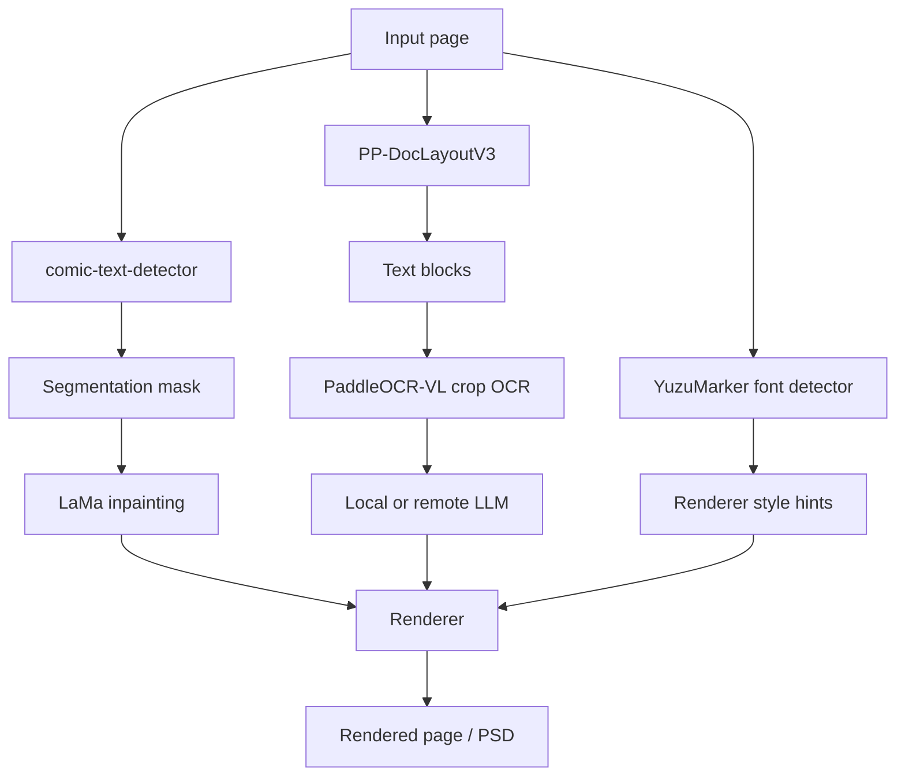
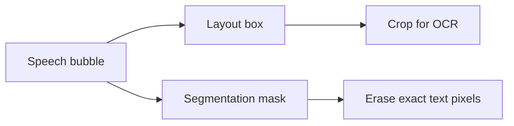

# 技術的な詳細解説

このページでは、Koharu の漫画翻訳パイプラインを技術面から説明します。各モデルが何をしているのか、各段階がどうつながるのか、そしてなぜレイアウト解析、segmentation mask、OCR、inpainting、翻訳を分けて扱うのかをまとめます。

## 実装ベースで見たページパイプライン

コード上の公開パイプライン段階は `Detect -> OCR -> Inpaint -> LLM Generate -> Render` ですが、detect 段階の中で既に 3 つの別作業をしています。

- ページのレイアウト解析
- テキスト前景の segmentation
- フォントと色の推定

この設計は意図的です。漫画翻訳ツールには、ページ構造の理解とピクセル精度の両方が必要だからです。

## モデル種別の一覧

| コンポーネント | 既定モデル | モデル種別 | Koharu での主な役割 |
| --- | --- | --- | --- |
| レイアウト解析 | [PP-DocLayoutV3](https://huggingface.co/PaddlePaddle/PP-DocLayoutV3_safetensors) | document layout detector | テキストらしい領域、ラベル、信頼度、読み順を見つける |
| Segmentation | [comic-text-detector](https://github.com/dmMaze/comic-text-detector) | text segmentation network | クリーンアップ用の dense text mask を作る |
| OCR | [PaddleOCR-VL-1.5](https://huggingface.co/PaddlePaddle/PaddleOCR-VL-1.5) | vision-language model | 切り出したテキスト領域を Unicode 文字列として読む |
| Inpainting | [lama-manga](https://huggingface.co/mayocream/lama-manga) / [LaMa](https://github.com/advimman/lama) | image inpainting network | 文字除去後の masked 領域を埋める |
| フォントヒント | [YuzuMarker.FontDetection](https://huggingface.co/fffonion/yuzumarker-font-detection) | image classifier / regressor | フォント系統、色、縁取りヒントを推定する |
| 翻訳 | [llama.cpp](https://github.com/ggml-org/llama.cpp) 経由のローカル GGUF モデル、またはリモート API | ローカルでは主に decoder-only LLM | OCR テキストを対象言語へ翻訳する |

## なぜ漫画ページでレイアウト解析が重要なのか

レイアウト解析は、単に「テキストの周囲に box を置く」だけではありません。漫画ページでは、少なくとも次の構造的な問いに答える必要があります。

- そもそもどの領域がテキストらしいか
- おおよその読み順がどうなっているか
- そのブロックが縦書きとして扱うべき縦長領域か
- OCR 前にどの box を重複除去するべきか
- その領域が caption、吹き出し本文、タイトル、その他レイアウト要素のどれに近いか

漫画は視覚的に密度が高いので、ここが非常に重要です。

- 吹き出しは曲がっていたり傾いていたりする
- テキストがスクリーントーンやアクション線に重なる
- 縦書き日本語と横書きラテン文字が同じページに混在する
- 読み取るべき領域の形と、消すべきピクセルの形が一致しないことがある

Koharu はまずレイアウト出力から `TextBlock` を作り、それを OCR や後段のレンダリングの基盤にします。

現在の実装では、レイアウト段階は次のように動きます。

- `PP-DocLayoutV3::inference_one_fast(...)` を実行する
- テキストらしいラベルの領域を残す
- それを `TextBlock` に変換する
- 大きく重なった領域を重複除去する
- 縦横比から縦書き / 横書き方向を推定する

つまり、レイアウト解析はパイプライン全体の構造的な背骨です。

## segmentation mask とは何か

segmentation mask は、各ピクセルが対象クラスに属するかどうかを表す、画像サイズのマップです。Koharu の場合、対象クラスは実質的に「あとでクリーンアップ時に除去すべきテキスト前景」です。

これは bounding box とは異なります。

| 表現 | 意味 | 向いている用途 |
| --- | --- | --- |
| Bounding box | 粗い矩形領域 | OCR の切り出し、順序付け、UI 編集 |
| Polygon | より密な幾何輪郭 | 行レベルの形状表現 |
| Segmentation mask | ピクセル単位の前景マップ | inpainting と精密なクリーンアップ |

Koharu では、segmentation 経路はレイアウトとは意図的に分離されています。

- `comic-text-detector` がグレースケールの確率マップを出す
- Koharu がそれを後処理で洗練する
- 洗練後の結果が `doc.segment` になる
- その後 LaMa が `doc.segment` を消去・補完用の mask として使う

この洗練工程が重要なのは、生の segmentation 確率がたいていソフトでノイジーだからです。Koharu は予測を threshold し、text block を意識した refinement を試み、最終的な 2 値 mask を dilation して、文字の縁や輪郭が残って halo になるのを防ぎます。

## Vision モデルは理論上どう動くのか

### レイアウト解析: detector と読み順推定の組み合わせ

[PP-DocLayoutV3](https://huggingface.co/PaddlePaddle/PP-DocLayoutV3) は、傾きや湾曲など平面ではない歪みを含む文書解析向けのレイアウトモデルです。model card には、漫画ページでも重要な性質が 2 つあります。

- 軸平行な 2 点 box だけでなく multi-point geometry を予測する
- 同じ forward pass で論理的な読み順も予測する

Koharu の Rust 実装もそれに沿っており、`pp_doclayout_v3` モジュールには `HGNetV2` バックボーンと attention ベースの encoder / decoder があり、推論結果として `label`、`score`、`bbox`、`polygon_points`、`order` が得られます。

概念的には、これは OCR そのものというより object detection と layout parsing に近い処理です。

### Segmentation: ピクセル密度の高いテキスト予測

Koharu の `comic-text-detector` 経路は segmentation-first な設計です。Rust 版では次を読み込みます。

- YOLOv5 系のバックボーン
- mask 予測用の U-Net デコーダ
- フル検出モード向けのオプション DBNet head

既定のページパイプラインでは segmentation-only 経路を使います。Koharu はすでに `PP-DocLayoutV3` からレイアウト box を得ているからです。つまり Koharu は次の組み合わせを取っています。

- ページ構造に強いモデル
- ピクセル単位のテキスト前景抽出に強いモデル

これは、box だけに頼るよりクリーンアップに向いた構成です。

### OCR: 画像 crop から文字 token への multimodal decoding

[PaddleOCR-VL](https://huggingface.co/docs/transformers/en/model_doc/paddleocr_vl) はコンパクトな vision-language model です。公式アーキテクチャ説明では、次を組み合わせたものとされています。

- NaViT 風の動的解像度 visual encoder
- ERNIE-4.5-0.3B language model

理論上、この OCR は multimodal sequence generation として考えられます。

1. 画像 crop が visual token にエンコードされる
2. `OCR:` のようなテキストプロンプトがタスク条件を与える
3. decoder が自己回帰的に認識済みテキスト token を出力する

Koharu の実装もかなりこの形に近いです。

- `PaddleOCR-VL-1.5.gguf` と別の multimodal projector を読み込む
- llama.cpp の multimodal 経路で画像を注入する
- `OCR:` をプロンプトに使う
- 各 crop に対して greedily に文字列をデコードする

つまり、Koharu の OCR は古典的な CTC 専用 recognizer ではなく、小型の document-oriented VLM を狭い OCR タスクに使っている形です。

### Inpainting: なぜ LaMa は Fourier convolution を使うのか

[LaMa](https://github.com/advimman/lama) は、大きな mask 領域向けに設計された inpainting モデルです。論文タイトルでも、重要な発想は明示されています。*Resolution-robust Large Mask Inpainting with Fourier Convolutions* です。

直感的には、次の違いがあります。

- 通常の convolution は局所的
- テキスト除去では、吹き出しや背景の遠い文脈が必要になる
- 周波数領域の演算は広域文脈を効率よく扱える

ここで FFT が出てきます。

#### ここでの FFT とは

FFT は **Fast Fourier Transform** の略です。これは次の 2 つの表現の間を高速に行き来するアルゴリズムです。

- 画素が存在する空間領域
- 繰り返しパターンや大域構造を扱いやすい周波数領域

Koharu の LaMa 実装では、`FourierUnit` がまさにこれを行います。

1. 特徴マップに `rfft2` を適用する
2. 実部と虚部チャネルに対して学習済み `1x1` convolution をかける
3. `irfft2` を適用して画像空間へ戻す

Koharu は CPU / CUDA / Metal 向けに独自の `rfft2` と `irfft2` 演算も実装しているので、同じ spectral block を複数ハードウェアで走らせられます。

漫画のクリーンアップでは、欠損領域は小さな傷ではなく、グラデーションやスクリーントーン、線画端を含む吹き出し内部全体になることがあります。Fourier 系の大域混合は、穴を埋めながらより大きな構造を保つのに有利です。

## ローカル LLM とモデル種別

Koharu のローカル翻訳経路は、`llama.cpp` 経由で GGUF モデルを使います。実際には、多くが量子化済みの decoder-only transformer です。

理論としては、現代的な LLM 推論と同じです。

- OCR テキストを token 化する
- 増えていく token 列に対して masked self-attention を実行する
- 出力が終わるまで次 token を繰り返し予測する

実用上のトレードオフも一般的です。

- 大きいモデルほど翻訳品質は高くなりやすい
- 小さい量子化モデルほど VRAM と RAM を節約できる
- リモートプロバイダは、ローカルのプライバシーと引き換えに大きなホスト型モデルを使いやすい

リモートのテキスト生成プロバイダを使う場合でも、Koharu は画像理解段階をローカルで行います。リモート側が必要とするのは OCR テキストだけです。

## Koharu 固有の実装メモ

高レベルの説明だけでは見落としやすい点を挙げると、次の通りです。

- detect 段階では現在 `ComicTextDetector::load_segmentation_only(...)` を使っており、DBNet 付きフル検出モードではない
- segmentation mask は inpainting 前に現在の text block に対して refinement される
- OCR は元ページ全体ではなく、切り出した text block 画像に対して実行される
- OCR ラッパーは multimodal llama.cpp 経路と `OCR:` プロンプトを使う
- inpainting は `doc.segment` を消去 mask として使うので、mask が悪いとそのままクリーンアップ品質に出る
- フォント予測結果はレンダリング前に正規化され、黒や白に近い色はよりきれいな値へ寄せられる

## 推奨読み物

### 公式モデル / プロジェクト資料

- [PP-DocLayoutV3 model card](https://huggingface.co/PaddlePaddle/PP-DocLayoutV3)
- [PaddleOCR-VL-1.5 model card](https://huggingface.co/PaddlePaddle/PaddleOCR-VL-1.5)
- [PaddleOCR-VL architecture docs in Hugging Face Transformers](https://huggingface.co/docs/transformers/en/model_doc/paddleocr_vl)
- [comic-text-detector repository](https://github.com/dmMaze/comic-text-detector)
- [LaMa repository](https://github.com/advimman/lama)
- [llama.cpp](https://github.com/ggml-org/llama.cpp)

### 背景理論と Wikipedia の図

一般理論や概要図を先に確認したい場合は、次のページが役立ちます。

- [Fourier transform](https://en.wikipedia.org/wiki/Fourier_transform)
- [Image segmentation](https://en.wikipedia.org/wiki/Image_segmentation)
- [Optical character recognition](https://en.wikipedia.org/wiki/Optical_character_recognition)
- [Transformer (deep learning architecture)](https://en.wikipedia.org/wiki/Transformer_(deep_learning_architecture))
- [Object detection](https://en.wikipedia.org/wiki/Object_detection)
- [Inpainting](https://en.wikipedia.org/wiki/Inpainting)

これらの Wikipedia リンクは背景知識向けです。Koharu 固有の挙動や実際のモデル構成については、公式 model card とソースツリーを優先してください。
