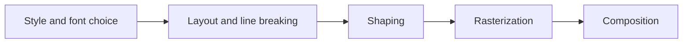
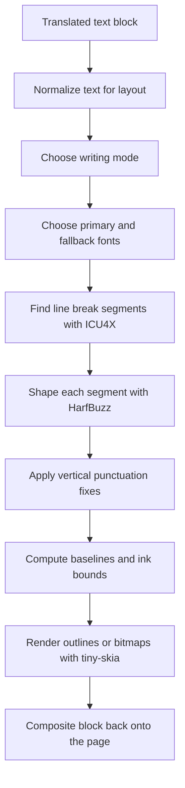

# テキストレンダリングと縦書き CJK レイアウト

テキストレンダリングは、漫画翻訳ツールの中でも特に難しい部分です。detection、OCR、inpainting はページに何を起こすべきかを決めますが、最終結果が「デバッグ用オーバーレイ」ではなく本物の漫画ページに見えるかどうかを決めるのはレンダラです。

外部資料として特に有用なのが、Aria Desires による [Text Rendering Hates You](https://faultlore.com/blah/text-hates-you/) です。Koharu にもその主張はそのまま当てはまります。テキストレンダリングはきれいな直列問題ではなく、完全な正解もありません。レイアウト、shaping、font fallback、rasterization、composition は相互に影響し合います。

Koharu はフル機能の DTP エンジンを目指してはいません。代わりに、漫画ページで特によく必要になるテキストレイアウト、特に縦書き CJK の吹き出しテキストをかなり高い水準で扱うことを目指しています。

## なぜこの問題は難しいのか

Faultlore の記事では、レンダラを次のような段階に分けています。

この図はわかりやすいですが、実際には各段階は独立していません。

- 最終的な行分割は shaped advances が分からないと決められない
- 正しい shaping には文字方向と OpenType feature が必要
- 漫画ページには複数の文字種、記号、emoji が混じるので、1 つのフォントだけでは足りない
- 実際のテキストは glyph run に整形されるため、コードポイントを 1 文字ずつ描いても正しくならない
- 吹き出しの box が、そのままレンダラの真の ink bounds になるとは限らない

縦書き漫画テキストでは、さらに難しさが増します。

- 列は上から下へ流れるが、列そのものは右から左へ並ぶ
- 句読点には縦書き用の字形や再センタリングが必要になる
- 正しい縦書き字形を持つフォントもあれば、持たないフォントもある
- 日本語、中国語、ラテン文字、数字、記号、emoji が同じブロックに混在することが多い

## Koharu が実際にやっていること

実装としては、レンダラは `koharu-renderer` クレートにあり、主な調停は `src/facade.rs`、`src/layout.rs`、`src/shape.rs`、`src/segment.rs`、`src/renderer.rs` で行われています。

翻訳済み `TextBlock` 1 つに対する流れは、おおむね次の通りです。

具体的には次の役割分担です。

- `LineBreaker` は ICU4X の line segmentation を使う
- `TextShaper` は `harfrust` 経由で HarfBuzz を使う
- `TextLayout` は shaped run を行または縦列に変換する
- `TinySkiaRenderer` は `skrifa` でアウトラインを rasterize し、必要なら `fontdue` の bitmap にフォールバックする
- `Renderer::render_text_block` がそれらをフォントヒント、縁取り設定、ページ上の配置と統合する

## Koharu はどうやって縦書きレイアウトを選ぶのか

Koharu は、CJK を含むテキストを無条件で全部縦書きにするわけではありません。`text/script.rs` にある現在のヒューリスティックは次です。

- 翻訳文に CJK が含まれ、かつブロックが横幅より高さのほうが大きければ `VerticalRl` を使う
- それ以外は横書きのままにする

つまり、縦書きレイアウトは次の両方に依存します。

- 文字種の検出
- detection またはユーザー調整後のテキスト box 形状

これは意図的にシンプルです。漫画の吹き出しではかなりの割合でうまく機能し、日本語文字が 1 文字あるだけの mixed-script caption まで全部縦書きにしてしまうのを避けられます。

ただし、これは万能の writing-mode エンジンではなくヒューリスティックです。エッジケースや現行レンダラの限界を考える上で、この点は重要です。

## 縦書き CJK はどう実装されているか

### 1. Writing mode を本当の shaping direction に変換する

`WritingMode::VerticalRl` は、最終キャンバス上で回転させるだけの仕組みではありません。

Koharu はこれを HarfBuzz 実行前に top-to-bottom の shaping direction へ変換します。これにより、フォントと shaping engine は「横書きテキストを後から回しただけ」の扱いではなく、縦書き用の advance や glyph form を本物として生成できます。

### 2. 縦書き OpenType feature を有効にする

Koharu は縦書き shaping のときに次の OpenType feature を有効にします。

- `vert`
- `vrt2`

これらは、縦書きに正しく対応したフォントが使う標準的な vertical alternates です。Koharu の縦書き出力が、単に横書きを回転した見た目ではなく、かなり自然な縦書き CJK レイアウトになる大きな理由の 1 つがここです。

フォントに proper vertical glyph substitution があればそれを使えますし、なければそのフォントが提供できる水準まで品質が落ちます。

### 3. 行が列になる

縦書きモードでは、レイアウトロジックの主軸が入れ替わります。

- `max_height` が 1 列を制限する値になる
- 列ごとの advance は `y_advance` から読む
- 各新しい line は新しい列になる

その後、baseline は次のように配置されます。

- glyph は 1 列の中で下方向へ進む
- 最初の列は右側から始まる
- 追加の列は line height に従って左へ進む

これは、伝統的な日本語の漫画吹き出しで期待される `vertical-rl` の流れです。

### 4. 全角句読点を再センタリングする

縦書き CJK レイアウトでは、句読点を横書き前提のまま配置するとすぐに不自然になります。Koharu は全角句読点を明示的に扱い、実際の font bounds から再センタリングします。

対象となるのは次のようなケースです。

- ideographic comma や full stop
- 全角句読点ブロック
- 括弧や corner mark
- 中点や類似記号

これは単なる見た目の小手先ではありません。現行の縦書き経路が、汎用レンダラよりずっと意図を感じる見た目になる理由の 1 つです。

### 5. 強調系の句読点を正規化する

レイアウトコードは、縦書きテキスト向けに強調記号のペアも正規化します。たとえば、連続した `!` や `?` の組み合わせは、shaping 前に対応する結合 Unicode 形へまとめられることがあります。

これにより、横書き前提の記号を細い縦列に無理やり積んだような見た目ではなく、漫画らしい縦方向の句読点表現を保ちやすくなります。

### 6. ink bounds をきつく測る

レイアウト後、Koharu は glyph ごとのメトリクスからタイトな ink bounding box を計算し、その後 baseline を平行移動して真の ink origin が `(0, 0)` から始まるようにします。

これが重要なのは次の理由です。

- フォントメトリクスだけでは clipping を防ぎきれない
- 縦書き句読点や代替 glyph には予想外の extents がある
- outline glyph と bitmap glyph の両方を同じ surface に安定して載せたい

実際、この bounds 処理は、テキスト上端・下端・右端が常に削られるような不安定さを防いでいる重要な部品です。

## なぜ漫画の吹き出しで見た目が良いのか

Koharu は、一般的な漫画ケースで価値の高い点をいくつもきちんと押さえています。

- 文字単位描画ではなく、本物の shaping を使う
- 完成後の横書きテキストを回すのではなく、縦書き font feature を有効にする
- 縦書き CJK で右から左への列進行をサポートする
- ICU4X の line segmentation を使い、雑な文字単位折り返しに頼らない
- 1 つのフォントに記号や emoji がない場合に font fallback できる
- 縦書き時に全角句読点を中央寄せする
- 縦方向フローや縦書き中国語 / 日本語出力を確認するテストがある

この組み合わせにより、Koharu のレンダラは「一応対応している」ではなく、意図のある読みやすい縦書き CJK を出せます。

## どれくらい完璧なのか

よくある漫画用途にはかなり強いです。ただし、完璧な日本語組版エンジンではありません。

ここははっきり区別すべきです。

Koharu は次のように理解するのが適切です。

- 横書きを回転するだけの方式よりはるかに良い
- 現代的な CJK フォントでの縦書き吹き出しレイアウトには強い
- 実用的な漫画翻訳作業向けに意図的に調整されている
- それでも、数学的・組版的に完全無欠ではなく best-effort の範囲

## 現在の限界

コードベースは、レンダラがまだ未完成な箇所について比較的正直です。

### Writing mode はヒューリスティック

縦書きモードは現在、次の 2 つに依存しています。

- 翻訳文に CJK が含まれるか
- ブロックが横幅より縦に長いか

これは吹き出しでは驚くほどよく当たりますが、あくまでヒューリスティックです。mixed-script caption、横倒しの注記、特殊な SFX ブロックでは手修正が必要になることがあります。

### CJK の改行規則はまだ ICU の既定動作ベース

`segment.rs` には CJK 向けカスタマイズの `TODO` が明示されています。ICU4X によって ad hoc な折り返しよりずっとましな土台は得ていますが、まだ漫画専用の禁則処理実装ではありません。

### フォント対応の影響が大きい

縦書き alternates の見た目は、選ばれたフォント次第です。システムフォントが proper vertical forms を持っていなければ、レンダラ側だけで完全な商用 CJK フォント品質を捏造することはできません。

### フル組版エンジンの機能はない

Koharu は、完全な composition system が持つ高度な文字組み機能を全部実装しようとはしていません。現在のレンダラには、少なくとも次のような機能はフル実装されていません。

- ルビ
- 割注などの高度な日本語レイアウト機能
- 複雑な ligature を含む run 単位の完全な mixed styling
- すべての glyph run に対する細粒度な手動組版制御

### 翻訳文の長さは依然としてレイアウト品質に影響する

shaping が良くても、翻訳文そのものが長すぎたり、与えられた吹き出しに対して不自然すぎたりすることはあります。レンダラは text fitting と整列を助けますが、悪い box 形状や冗長な翻訳を常に完璧なレタリングへ変えられるわけではありません。

## なぜ Koharu は単純にテキストを回転させないのか

縦書きテキストの安易な方法は、横書きで並べてから全部回転することです。Koharu がそれを避けるのは、破綻が明白だからです。

- 句読点の位置が不自然になる
- glyph の advance が正しくない
- 列の流れが嘘っぽくなる
- フォントが vertical alternate を適用できない
- bounds と clipping の扱いも難しくなる

Koharu は代わりに、縦書き処理を shaping とレイアウト段階へ押し戻しています。これが縦書き CJK 出力の根本的な設計判断です。

## 読んでおく価値のある外部資料

[Text Rendering Hates You](https://faultlore.com/blah/text-hates-you/) が有用なのは、特定言語や特定実装に依存しない形でレンダラ問題を説明しているからです。Koharu の具体的なスタックはブラウザエンジンとは違いますが、根本の教訓は同じです。

- shaping は省略できない
- fallback font は避けられない
- レイアウトと shaping は相互依存している
- 「完璧な」テキストレンダリングというものは、実装してみる前にだけ簡単に思える

短く言えば、Koharu のレンダラが慎重なのは、テキストレンダリングが本当に面倒だからです。
