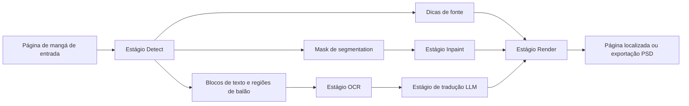

# Como o Koharu Funciona

O Koharu é construído em torno de uma pipeline por estágios para tradução de mangá. O editor apresenta essa pipeline como um fluxo de trabalho simples, mas a implementação mantém detection, segmentation, OCR, inpainting, tradução e renderização separados porque cada estágio produz dados diferentes e falha de formas diferentes.

## A pipeline em uma visão geral

No nível público da pipeline, o Koharu executa:

1. `Detect`
2. `OCR`
3. `Inpaint`
4. `LLM Generate`
5. `Render`

O detalhe importante de implementação é que `Detect` já é um estágio multi-modelo:

- `comic-text-bubble-detector` encontra blocos de texto e regiões de balão de fala.
- `comic-text-detector-seg` produz um mapa de probabilidade de texto por pixel que se torna o mask de limpeza.
- `YuzuMarker.FontDetection` estima dicas de fonte e cor para a renderização posterior.

Essa divisão permite que o Koharu use um modelo para raciocinar sobre a estrutura da página e outro para decidir quais pixels exatos devem ser removidos.

## O que cada estágio produz

| Estágio | Principais modelos | Saída principal |
| --- | --- | --- |
| Detect | `comic-text-bubble-detector`, `comic-text-detector-seg`, `YuzuMarker.FontDetection` | blocos de texto, regiões de balão, mask de segmentation, dicas de fonte |
| OCR | `PaddleOCR-VL-1.5` | texto de origem reconhecido para cada bloco |
| Inpaint | `aot-inpainting` | página com o texto original removido |
| LLM Generate | LLM GGUF local ou provedor remoto | texto traduzido |
| Render | renderer do Koharu | página localizada final ou exportação |

## Por que os estágios são separados

Páginas de mangá são muito mais difíceis do que OCR comum de documentos:

- balões de fala são irregulares e frequentemente curvos
- texto japonês pode ser vertical enquanto legendas ou SFX podem ser horizontais
- o texto pode se sobrepor à arte, screentones, linhas de velocidade e bordas de painéis
- a ordem de leitura faz parte da estrutura da página, não apenas dos pixels brutos

Por causa disso, um único modelo geralmente não é suficiente. O Koharu primeiro encontra blocos de texto e regiões de balão, depois executa OCR em regiões recortadas, em seguida usa um mask de segmentation para limpeza e só então pede a um LLM para traduzir o texto.

## A forma da implementação

Na árvore de código-fonte, o registro de engines e a execução da pipeline ficam em `koharu-app/src/engine.rs`, enquanto a seleção padrão de engine fica em `koharu-app/src/config.rs`.

Alguns detalhes de implementação importam:

- o engine detect padrão é `comic-text-bubble-detector`, que escreve valores `TextBlock` e regiões de balão em uma única passagem
- `comic-text-detector-seg` é executado depois que os blocos de texto existem e armazena o mask final de limpeza como `doc.segment`
- o OCR é executado em regiões de texto recortadas, não na página inteira
- o inpainting consome o mask de segmentation atual, não apenas uma caixa retangular
- quando você escolhe um provedor LLM remoto, o Koharu envia o texto do OCR para tradução, não a imagem completa da página
- estágios individuais podem ser trocados em **Configurações > Engines** sem mudar o resto da pipeline

## Por que o stack importa

O Koharu usa:

- [candle](https://github.com/huggingface/candle) para inferência de alto desempenho
- [llama.cpp](https://github.com/ggml-org/llama.cpp) para inferência local de LLM
- [Tauri](https://github.com/tauri-apps/tauri) para o shell do aplicativo desktop
- Rust em todo o stack por desempenho e segurança de memória

## Design local-first

Por padrão, o Koharu executa:

- modelos de visão localmente
- LLMs locais localmente

Se você configurar um provedor LLM remoto, o Koharu envia apenas o texto do OCR selecionado para tradução a esse provedor.

## Quer a versão técnica aprofundada?

Veja [Mergulho Técnico Profundo](technical-deep-dive.md) para tipos de modelos, comportamento do mask de segmentation, AOT inpainting e referências dos modelos upstream. Veja [Renderização de Texto e Layout Vertical CJK](text-rendering-and-vertical-cjk-layout.md) para detalhes internos do renderer, comportamento do modo de escrita vertical e limites atuais de layout.

