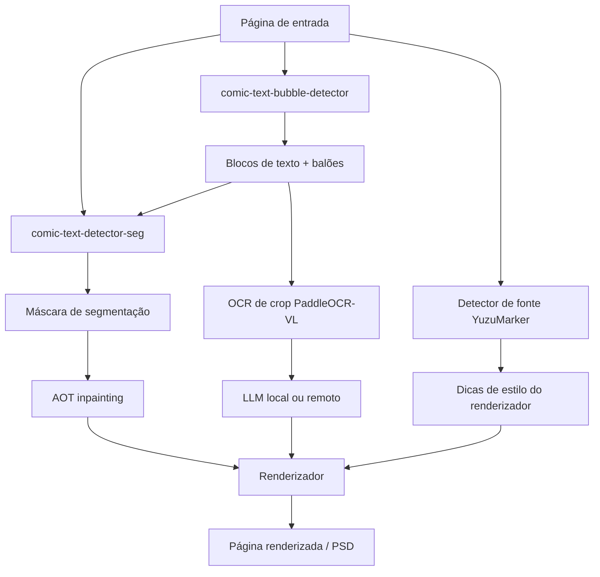
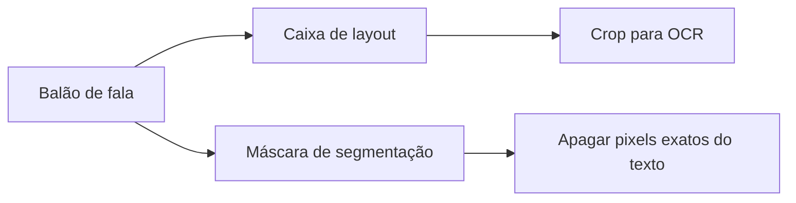

# Mergulho Técnico Profundo

Esta página cobre a estrutura técnica da pipeline de mangá do Koharu: o que cada modelo faz, como os estágios se encaixam e por que detecção de texto e balão, máscaras de segmentação, OCR, inpainting e tradução são tratados separadamente.

## A pipeline da página em termos de implementação

No nível do código, a pipeline pública é `Detect -> OCR -> Inpaint -> LLM Generate -> Render`, mas o estágio detect já está fazendo três trabalhos distintos:

- detecção de texto e balão
- segmentação de primeiro plano do texto
- estimativa de fonte e cor

Esse design é intencional. Uma ferramenta de tradução de mangá precisa tanto de estrutura da página quanto de precisão ao nível do pixel.

## Tipos de modelos em uma visão geral

| Componente | Modelo padrão | Tipo de modelo | Trabalho principal no Koharu |
| --- | --- | --- | --- |
| Detecção de texto e balão | [comic-text-bubble-detector](https://huggingface.co/ogkalu/comic-text-and-bubble-detector) | detector de objetos | encontrar blocos de texto e regiões de balão de fala |
| Segmentação | [comic-text-detector](https://github.com/dmMaze/comic-text-detector) | rede de segmentação de texto | produzir uma máscara densa de texto para limpeza |
| OCR | [PaddleOCR-VL-1.5](https://huggingface.co/PaddlePaddle/PaddleOCR-VL-1.5) | modelo de linguagem visual | ler regiões de texto recortadas em texto Unicode |
| Inpainting | [aot-inpainting](https://huggingface.co/mayocream/aot-inpainting) / [manga-image-translator](https://github.com/zyddnys/manga-image-translator) | rede de inpainting de imagem | preencher regiões mascaradas após a remoção do texto |
| Dicas de fonte | [YuzuMarker.FontDetection](https://huggingface.co/fffonion/yuzumarker-font-detection) | classificador / regressor de imagem | estimar família da fonte, cores e dicas de traço |
| Tradução | modelo GGUF local via [llama.cpp](https://github.com/ggml-org/llama.cpp) ou API remota | LLM decoder-only na maioria das configurações locais | traduzir o texto do OCR para o idioma de destino |

Alternativas internas opcionais ainda estão disponíveis. As principais são [PP-DocLayoutV3](https://huggingface.co/PaddlePaddle/PP-DocLayoutV3_safetensors) como detector alternativo e engine de análise de layout, [speech-bubble-segmentation](https://huggingface.co/mayocream/speech-bubble-segmentation) como detector dedicado de balões e [lama-manga](https://huggingface.co/mayocream/lama-manga) como inpainter alternativo.

## Por que a detecção de texto e balão importa em páginas de mangá

Detecção não é só "achar caixas ao redor do texto". Em páginas de mangá, ela precisa responder a várias perguntas estruturais:

- quais regiões são parecidas com texto
- onde estão os balões de fala
- se um bloco é alto o suficiente para se comportar como texto vertical
- quais caixas devem ser desduplicadas antes do OCR
- quais regiões devem se tornar registros `TextBlock` editáveis

Isso importa porque páginas de mangá são visualmente densas:

- balões de fala são frequentemente curvos ou inclinados
- o texto pode ficar em cima de screentones e linhas de ação
- japonês vertical e texto latino horizontal podem coexistir na mesma página
- a região que deve ser lida nem sempre tem a mesma forma que os pixels que devem ser apagados

O Koharu primeiro converte a saída do detector em registros `TextBlock` e depois usa esses blocos para orientar o OCR e, mais tarde, a renderização. Regiões de balão são mantidas como geometria separada para que a UI e as ferramentas downstream ainda possam raciocinar sobre a área do balão de fala.

Na implementação atual, o estágio detect padrão:

- executa a versão em Candle de `ogkalu/comic-text-and-bubble-detector`
- converte as detecções de texto em valores `TextBlock`
- converte as detecções de balões em valores `BubbleRegion`
- ordena os blocos de texto na ordem de leitura de mangá antes do OCR

Se você preferir um detector no estilo document-layout, o `PP-DocLayoutV3` ainda está disponível como engine alternativo. Ele simplesmente não é mais o padrão.

## O que é uma máscara de segmentação

Uma máscara de segmentação é um mapa do tamanho da imagem no qual cada pixel indica se ele pertence a uma classe-alvo. No caso do Koharu, essa classe é efetivamente "primeiro plano do texto que deve ser removido mais tarde durante a limpeza".

Isso é diferente de uma bounding box:

| Representação | O que significa | Melhor uso |
| --- | --- | --- |
| Bounding box | região retangular grosseira | seleção de crop para OCR, ordenação, edição na UI |
| Polígono | contorno geométrico mais justo | geometria ao nível de linha |
| Máscara de segmentação | mapa de primeiro plano por pixel | inpainting e limpeza precisa |

No Koharu, o caminho de segmentação é intencionalmente separado do layout:

- `comic-text-detector` produz um mapa de probabilidade em escala de cinza
- o Koharu aplica threshold e dilata esse mapa com pós-processamento leve
- a máscara binária resultante se torna `doc.segment`
- `aot-inpainting` então usa `doc.segment` como a máscara de apagar e preencher para o inpainting

A etapa de limpeza ainda importa porque as probabilidades brutas de segmentação geralmente são suaves e ruidosas. O Koharu aplica threshold na predição e dilata a máscara binária final para que a limpeza cubra bordas e contornos do texto em vez de deixar halos para trás.

## Como os modelos de visão funcionam em teoria

### Detecção conjunta: blocos de texto e regiões de balão em uma única passagem

[ogkalu/comic-text-and-bubble-detector](https://huggingface.co/ogkalu/comic-text-and-bubble-detector) é o detector padrão porque prevê os dois tipos de região com os quais o resto da pipeline mais se importa:

- regiões parecidas com texto que devem se tornar `TextBlock`s
- regiões de balão de fala que devem permanecer disponíveis para o editor e ferramentas downstream

A versão em Candle do Koharu mapeia essas detecções em estruturas de dados do documento e, em seguida, ordena os blocos de texto na ordem de leitura de mangá antes do OCR. Conceitualmente, isso está mais próximo de detecção de objetos ao nível de página do que do próprio OCR.

### Segmentação: predição densa de texto por pixel

O caminho `comic-text-detector` do Koharu é segmentação-first. A versão em Rust carrega:

- um backbone no estilo YOLOv5
- um decoder U-Net para predição de máscara
- uma head DBNet opcional para modo de detecção completa

A pipeline de página padrão usa o caminho apenas de segmentação porque o Koharu já obtém blocos de texto de `comic-text-bubble-detector`. Isso significa que o Koharu combina:

- um modelo que é bom em detecção de região ao nível de página
- um modelo que é bom em primeiro plano de texto ao nível de pixel

Isso se encaixa muito melhor para limpeza do que depender apenas de caixas.

### OCR: decodificação multimodal de crops de imagem para tokens de texto

[PaddleOCR-VL](https://huggingface.co/docs/transformers/en/model_doc/paddleocr_vl) é um modelo de linguagem visual compacto. A arquitetura publicada combina:

- um encoder visual de resolução dinâmica no estilo NaViT
- o modelo de linguagem ERNIE-4.5-0.3B

No Koharu, o OCR é tratado como um problema de geração de sequência multimodal:

1. o crop da imagem é codificado em tokens visuais
2. um prompt de texto como `OCR:` condiciona a tarefa
3. o decoder emite autoregressivamente os tokens de texto reconhecidos

A implementação do Koharu segue esse padrão de perto:

- ela carrega `PaddleOCR-VL-1.5.gguf` e um projetor multimodal separado
- ela injeta a imagem através do caminho multimodal do llama.cpp
- ela usa o prompt `OCR:`
- ela decodifica gananciosamente o texto para cada crop

Então o OCR no Koharu não é um reconhecedor clássico apenas CTC. É um VLM compacto orientado a documentos usado para uma tarefa de OCR com escopo bem definido.

### Inpainting: por que o padrão agora é AOT

O inpainter padrão é o modelo AOT do [manga-image-translator](https://github.com/zyddnys/manga-image-translator), exposto no Koharu como `aot-inpainting`. É uma rede de inpainting de imagem mascarada construída em torno de gated convolutions e blocos repetidos de mistura de contexto com múltiplas taxas de dilatação.

A intuição prática é:

- a remoção de texto precisa de mais do que o preenchimento de um crop retangular
- o modelo precisa tanto de detalhes locais de borda quanto de contexto mais amplo do balão ou do fundo
- blocos repetidos de multi-dilatação são uma maneira prática de misturar esse contexto sem mudar o resto do contrato da pipeline

A versão em Candle do Koharu segue de perto a forma de inferência upstream:

1. redimensiona páginas grandes para um lado máximo configurável
2. faz padding da imagem de trabalho para um formato múltiplo de 8
3. alimenta a imagem RGB mascarada mais uma máscara binária de texto na rede
4. compõe os pixels previstos de volta no tamanho original da imagem

`lama-manga` ainda está disponível como engine alternativo se você quiser o comportamento baseado em Fourier do LaMa, mas ele não é mais o padrão.

## LLMs locais e tipo de modelo

O caminho de tradução local do Koharu usa modelos GGUF através do `llama.cpp`. Na prática, estes são geralmente transformers decoder-only quantizados.

A teoria é a inferência padrão de LLM moderno:

- tokenizar o texto do OCR
- executar self-attention mascarada sobre a sequência de tokens crescente
- prever o próximo token repetidamente até que a saída esteja completa

O trade-off prático também é familiar:

- modelos maiores geralmente traduzem melhor
- modelos menores quantizados usam menos VRAM e RAM
- provedores remotos trocam a privacidade local por acesso mais fácil a modelos hospedados maiores

O Koharu mantém as etapas de entendimento de imagem locais mesmo quando você escolhe um provedor remoto de geração de texto. O lado remoto só precisa do texto do OCR.

## Notas de implementação específicas do Koharu

Alguns detalhes são fáceis de perder se você ler apenas a documentação de alto nível:

- o estágio detect padrão é `comic-text-bubble-detector`, não `PP-DocLayoutV3`
- `comic-text-detector-seg` ainda carrega o caminho apenas de segmentação de `comic-text-detector` para `doc.segment`
- a máscara de segmentação é atualmente construída a partir de thresholding mais dilatação, não do caminho antigo de refinamento ciente de blocos
- o OCR é executado em imagens de blocos de texto recortados, não na página inteira original
- o wrapper de OCR usa o caminho multimodal do llama.cpp e o prompt de tarefa `OCR:`
- o inpainting consome `doc.segment`, então máscaras ruins levam diretamente a limpezas ruins
- o inpainter padrão é `aot-inpainting`, enquanto `lama-manga` permanece selecionável como alternativa
- a predição de fonte é normalizada antes da renderização para que cores próximas do preto e do branco sejam ajustadas para valores mais limpos

## Leitura recomendada

### Referências oficiais de modelos e projetos

- [Model card do comic-text-and-bubble-detector](https://huggingface.co/ogkalu/comic-text-and-bubble-detector)
- [Model card do PaddleOCR-VL-1.5](https://huggingface.co/PaddlePaddle/PaddleOCR-VL-1.5)
- [Documentação da arquitetura PaddleOCR-VL no Hugging Face Transformers](https://huggingface.co/docs/transformers/en/model_doc/paddleocr_vl)
- [Repositório do comic-text-detector](https://github.com/dmMaze/comic-text-detector)
- [Repositório do manga-image-translator](https://github.com/zyddnys/manga-image-translator)
- [Model card do YuzuMarker.FontDetection](https://huggingface.co/fffonion/yuzumarker-font-detection)
- [Model card do PP-DocLayoutV3](https://huggingface.co/PaddlePaddle/PP-DocLayoutV3)
- [Repositório do LaMa](https://github.com/advimman/lama)
- [llama.cpp](https://github.com/ggml-org/llama.cpp)

### Teoria de fundo e diagramas da Wikipédia

Essas páginas são úteis se você quiser a teoria geral e diagramas de visão geral antes de mergulhar nos model cards:

- [Transformada de Fourier](https://en.wikipedia.org/wiki/Fourier_transform)
- [Segmentação de imagens](https://en.wikipedia.org/wiki/Image_segmentation)
- [Optical character recognition](https://en.wikipedia.org/wiki/Optical_character_recognition)
- [Transformer (arquitetura de deep learning)](https://en.wikipedia.org/wiki/Transformer_(deep_learning_architecture))
- [Detecção de objetos](https://en.wikipedia.org/wiki/Object_detection)
- [Inpainting](https://en.wikipedia.org/wiki/Inpainting)

Esses links da Wikipédia são referências de fundo. Para o comportamento específico do Koharu e as escolhas reais de modelos, prefira os model cards oficiais e a árvore de código-fonte.
