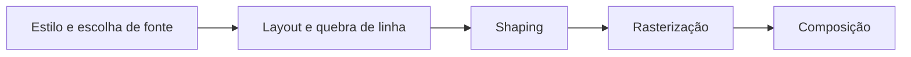
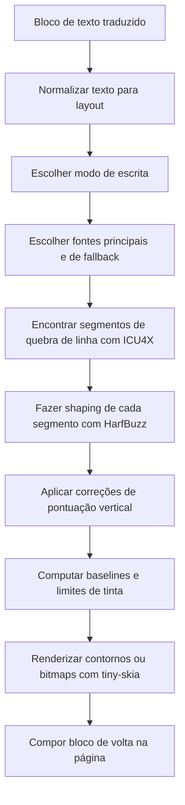

# Renderização de Texto e Layout Vertical CJK

A renderização de texto é uma das partes mais difíceis de um tradutor de mangá. Detecção, OCR e inpainting decidem o que deve acontecer com a página, mas o renderizador decide se o resultado ainda se lê como uma página de mangá finalizada em vez de uma sobreposição de depuração.

Uma referência externa útil é [Text Rendering Hates You](https://faultlore.com/blah/text-hates-you/) de Aria Desires. O ponto central se aplica diretamente ao Koharu: a renderização de texto não é um problema linear e limpo, e não existe uma resposta universalmente correta. Layout, shaping, fallback de fonte, rasterização e composição afetam uns aos outros.

O Koharu não tenta ser um mecanismo completo de publicação desktop. Ele busca ser muito bom nos padrões de layout de texto que as páginas de mangá mais precisam, especialmente texto vertical CJK em balões.

## Por que esse problema é difícil

O artigo do Faultlore divide um renderizador em um conjunto familiar de estágios:

Essa divisão é útil, mas na prática os estágios não permanecem independentes:

- você não pode saber as quebras de linha finais até conhecer os avanços do shaping
- você não pode fazer shaping de forma confiável sem conhecer a direção de escrita e as features OpenType
- você não pode escolher uma única fonte para todo o texto porque as páginas de mangá misturam scripts, símbolos e emojis
- você não pode simplesmente desenhar pontos de código um por um porque o texto real é moldado em runs de glifos
- você não pode assumir que a caixa de um balão é a mesma coisa que os limites reais de tinta do renderizador

O texto vertical de mangá torna o problema ainda mais difícil:

- as colunas fluem de cima para baixo, mas as próprias colunas fluem da direita para a esquerda
- a pontuação geralmente precisa de alternativas verticais ou recentralização
- algumas fontes suportam formas verticais adequadas e outras não
- japonês, chinês, latim, números, símbolos e emojis misturados frequentemente aparecem no mesmo bloco

## O que o Koharu realmente faz

No nível da implementação, o renderizador vive no crate `koharu-renderer`, e a orquestração principal acontece em `koharu-app/src/renderer.rs`, `src/layout.rs`, `src/shape.rs`, `src/segment.rs` e `src/renderer.rs`.

A pipeline para um `TextBlock` traduzido é aproximadamente:

Em termos concretos:

- `LineBreaker` usa segmentação de linha do ICU4X
- `TextShaper` usa HarfBuzz através de `harfrust`
- `TextLayout` transforma runs shaped em linhas ou colunas verticais
- `TinySkiaRenderer` rasteriza contornos com `skrifa` e faz fallback para bitmaps do `fontdue` quando necessário
- `Renderer::render_text_block` une tudo isso com dicas de fonte, escolhas de traço e posicionamento na página

## Como o Koharu escolhe o layout vertical

O Koharu não força cegamente todo texto CJK para o modo vertical. A heurística atual em `text/script.rs` é:

- se a tradução contém texto CJK e o bloco é mais alto do que largo, usa `VerticalRl`
- caso contrário, mantém o bloco horizontal

Isso significa que o layout vertical depende de ambos:

- detecção de script
- a geometria da caixa de texto detectada ou ajustada pelo usuário

Isso é simples de propósito. Ele corresponde a uma grande parcela do texto de balão de mangá e evita transformar cada legenda mista em texto vertical só porque contém um caractere japonês.

Ainda é uma heurística, não um mecanismo geral de modo de escrita. Isso importa para casos extremos e é um dos limites atuais do renderizador.

## Como o CJK vertical é implementado

### 1. O modo de escrita se torna uma direção real de shaping

`WritingMode::VerticalRl` não é apenas um truque final de rotação do canvas.

O Koharu o converte em uma direção de shaping de cima para baixo antes do HarfBuzz executar. Isso significa que a fonte e o engine de shaping podem produzir avanços verticais e formas verticais de glifos em vez de fingir que texto horizontal foi rotacionado depois.

### 2. Features OpenType verticais são ativadas

Quando o Koharu faz shaping de texto vertical, ele ativa as features OpenType:

- `vert`
- `vrt2`

Essas são as alternativas verticais padrão expostas por fontes que realmente suportam escrita vertical. Essa é uma das principais razões pelas quais o renderizador pode produzir um layout vertical CJK convincente em vez de parecer texto horizontal rotacionado.

Se a fonte tiver substituições apropriadas de glifos verticais, o Koharu pode usá-las. Se a fonte não tiver, o resultado degrada para o que a fonte fornecer.

### 3. Linhas se tornam colunas

No modo vertical, a lógica de layout inverte a extensão principal:

- `max_height` é o que limita uma coluna
- o avanço por coluna é lido de `y_advance`
- cada nova linha se torna uma nova coluna

As baselines são então posicionadas de forma que:

- os glifos avançam para baixo dentro de uma coluna
- a primeira coluna começa à direita
- colunas adicionais avançam para a esquerda pela altura da linha

Esse é o fluxo `vertical-rl` esperado usado em balões tradicionais de mangá japonês.

### 4. Pontuação fullwidth é recentralizada

O layout vertical CJK fica errado muito rápido se a pontuação for deixada com centralização horizontal ingênua. O Koharu tem tratamento explícito para pontuação fullwidth e recentraliza esses glifos a partir de seus limites reais na fonte.

Isso cobre casos como:

- vírgula ideográfica e ponto final
- blocos de pontuação fullwidth
- colchetes e marcas de canto
- pontos médios e marcas similares

Isso não é cosmético. É uma das razões pelas quais o caminho vertical atual parece mais intencional do que um renderizador genérico de texto.

### 5. Pontuação de ênfase é normalizada

O código de layout também normaliza pares de marcas de ênfase para texto vertical. Por exemplo, marcas `!` e `?` repetidas ou pareadas podem ser colapsadas nas formas Unicode combinadas correspondentes antes do shaping.

Isso ajuda a preservar a aparência vertical que os leitores esperam da pontuação de mangá em vez de empilhar escolhas desajeitadas de pontuação horizontal em uma coluna alta e estreita.

### 6. Os limites de tinta são medidos com precisão

Após o layout, o Koharu computa uma bounding box apertada de tinta a partir das métricas por glifo e, em seguida, translada as baselines para que a origem real da tinta comece em `(0, 0)`.

Isso é importante porque:

- as métricas da fonte sozinhas não são suficientes para evitar clipping
- pontuação vertical e formas alternativas de glifos podem ter extensões surpreendentes
- glifos de contorno e de bitmap precisam pousar na mesma superfície final de forma confiável

Na prática, essa passagem de limites é uma das razões pelas quais o renderizador parece estável em vez de estar constantemente recortando a borda superior, inferior ou direita do texto.

## Por que a saída é boa em balões de mangá

O Koharu acerta várias coisas de alto valor para o caso comum de mangá:

- ele usa shaping real, não desenho caractere por caractere
- ele ativa features verticais de fonte em vez de rotacionar texto horizontal finalizado
- ele suporta fluxo de colunas da direita para a esquerda para CJK vertical
- ele usa segmentação de linha ICU4X em vez de um loop ingênuo de split por caractere
- ele faz fallback entre fontes quando uma face está faltando um símbolo ou emoji
- ele centraliza pontuação fullwidth no modo vertical
- ele tem testes verificando especificamente a direção de fluxo vertical e a saída vertical em chinês e japonês

Essa combinação é por que o renderizador pode produzir texto vertical CJK que parece intencional e legível em vez de meramente "suportado".

## Quão perfeito é?

É forte para casos comuns de mangá. Não é um mecanismo completo de composição tipográfica japonesa.

Essa distinção importa.

O Koharu é melhor entendido como:

- muito melhor do que rotacionar texto horizontal
- bom no layout vertical de balões com fontes CJK modernas
- deliberadamente ajustado para o trabalho prático de tradução de mangá
- ainda um esforço da melhor forma possível, em vez de matematicamente ou tipograficamente perfeito

## Limites atuais

A base de código é bastante clara sobre onde o renderizador ainda está incompleto.

### O modo de escrita é heurístico

O modo vertical atualmente depende de:

- se a tradução contém texto CJK
- se o bloco é mais alto do que largo

Isso funciona surpreendentemente bem para balões, mas ainda é uma heurística. Legendas com scripts mistos, notas laterais e blocos SFX incomuns ainda podem precisar de correção manual.

### A quebra de linha CJK ainda usa o comportamento padrão do ICU

`segment.rs` nota explicitamente um `TODO` para customização específica de CJK. Então, embora o ICU4X já dê ao Koharu uma base muito melhor do que um wrapping ad hoc, ele ainda não é uma implementação kinsoku especializada para mangá.

### O suporte da fonte importa muito

As alternativas verticais só ficam tão boas quanto a fonte escolhida permite. Se a fonte do sistema não contiver formas verticais adequadas, o renderizador não pode inventar uma fonte CJK profissional completa do zero.

### Sem features completas de engine de publicação

O Koharu não está tentando fazer todas as features avançadas de texto que você esperaria de um sistema completo de composição. O renderizador atual não é uma implementação completa de coisas como:

- anotação ruby
- warichu e outras features avançadas de layout japonês
- estilização mista por run com comportamento complexo ciente de ligaturas
- controles tipográficos manuais completos para cada run de glifo

### O tamanho da tradução ainda muda a qualidade do layout

Mesmo com um bom shaping, uma tradução pode simplesmente ser muito longa ou muito desajeitada para o balão disponível. O renderizador pode encaixar e alinhar texto, mas nem sempre consegue transformar uma geometria de bloco ruim ou uma tradução excessivamente verbosa em uma letragem perfeita.

## Por que o Koharu não apenas rotaciona o texto

A solução barata para texto vertical é dispô-lo horizontalmente e rotacionar o resultado. O Koharu evita isso porque os modos de falha são óbvios:

- a pontuação fica incorretamente posicionada
- os avanços dos glifos ficam errados
- o fluxo de colunas parece falso
- as fontes não conseguem aplicar suas alternativas verticais
- os limites e o clipping ficam mais difíceis de raciocinar

Em vez disso, o Koharu empurra o tratamento vertical de volta para os estágios de shaping e layout. Essa é a principal decisão arquitetural por trás de sua saída vertical CJK.

## Referência externa que vale a leitura

[Text Rendering Hates You](https://faultlore.com/blah/text-hates-you/) é útil porque explica o problema do renderizador de uma forma agnóstica à linguagem. O stack do Koharu é diferente de um engine de navegador, mas as mesmas lições centrais aparecem aqui:

- shaping não é opcional
- fontes de fallback são inevitáveis
- layout e shaping dependem um do outro
- renderização de texto "perfeita" é principalmente uma história que as pessoas contam antes de implementá-la

Se você quer a versão curta: o renderizador do Koharu é cuidadoso porque a renderização de texto é um problema de sistemas acoplados, não uma etapa final de pintura.

