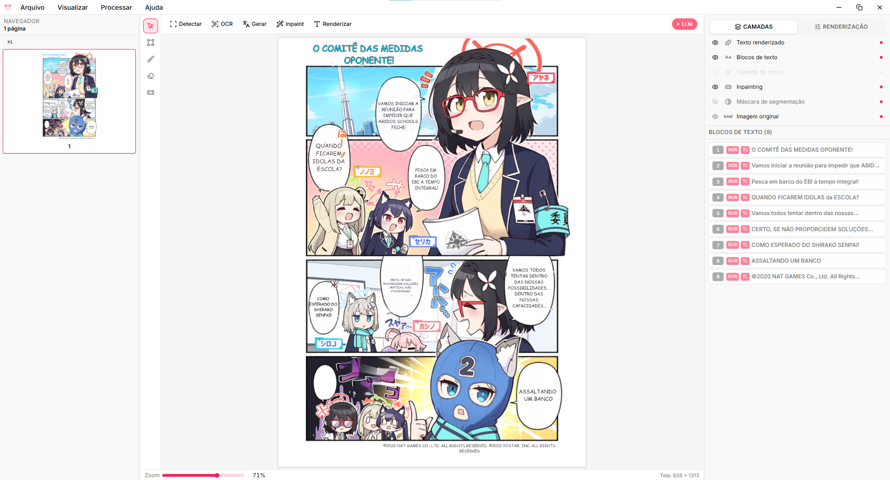
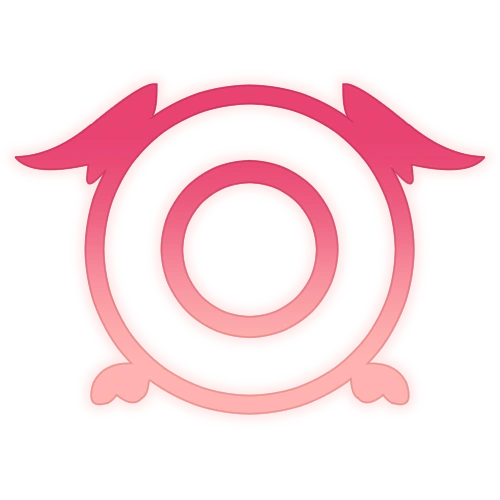

  <section class="kh-hero">
    

      

        

          Disponível agora:
          inferência local com llama.cpp
          
            Rode modelos GGUF localmente com aceleração CUDA, Vulkan ou Metal.
          
        

      

      

        <h1>Traduza mangá localmente, com privacidade e com um pipeline de produção de verdade.</h1>
        

          Koharu é um aplicativo desktop em Rust para tradução de mangá. Ele cuida de
          OCR, limpeza, tradução, revisão e exportação no Windows, macOS e Linux.
        

        

          
Modelos locais incluídos

          

            sakura
            vntl-llama3
            hunyuan
            lfm2
          

        

        

          <a class="kh-download-button" href="https://github.com/mayocream/koharu/releases/latest">
            Baixar
          </a>
          

            Gratuito e de código aberto.
          

        

      

    

    

      

        

          
        

      

    

  </section>

  <section class="kh-section">
    

      

        
Execução sem GUI

        <h2>Rode o Koharu sem a janela do desktop quando você precisar de uma Web UI local ou de um runtime de tradução scriptável.</h2>
        

          O app desktop é a interface principal, mas o mesmo runtime também pode rodar
          headless. Use-o para acesso via navegador, trabalho em lote reprodutível ou
          automação local que ainda dependa do pipeline por página do Koharu.
        

      

      

        

          
Modo headless

          

            Inicie o Koharu sem a janela do desktop e mantenha o mesmo runtime de
            tradução disponível por meio de uma sessão de navegador em uma porta local fixa.
          

          <pre><code># macOS / Linux
koharu --port 4000 --headless

# Windows
koharu.exe --port 4000 --headless</code></pre>
        

        

          
Para que serve o modo headless

          

            Use quando você precisar do fluxo do desktop em um formato mais fácil de
            scriptar, agendar ou expor a outras ferramentas locais.
          

          

            Web UI local
            Jobs em lote
            Scripts
            Host de desktop remoto
          

        

      

    

  </section>

  <section class="kh-section">
    

      

        
Integração com MCP

        <h2>Deixe agentes operarem o Koharu enquanto os modelos e os dados das páginas permanecem na máquina local.</h2>
        

          O Koharu tem suporte a MCP, então a UI desktop, o modo headless e fluxos de
          trabalho com agentes conversam com o mesmo runtime local de tradução, sem
          se dividirem em stacks separadas.
        

      

      

        

          <h3>Um runtime, vários pontos de entrada</h3>
          

            O mesmo pipeline de páginas alimenta a UI desktop, a Web UI headless e as
            ferramentas MCP, então a automação permanece alinhada com as sessões
            normais de edição.
          

        

        

          <h3>Tarefas de tradução amigáveis a agentes</h3>
          

            Use agentes para tradução em lote, ciclos de revisão, exportações e
            ferramentas auxiliares que precisem de acesso a OCR, limpeza, tradução e
            saídas em nível de página.
          

        

      

    

  </section>

  <section class="kh-dev">
    

      

        
        
Amigável para desenvolvedores

        <h2>Compile a partir do código-fonte e reutilize o mesmo runtime nas suas próprias ferramentas.</h2>
        

          O Koharu foi pensado para ser prático de compilar e prático de integrar. Use
          Bun e Rust para builds locais, flags estáveis de runtime para deploy e o
          modo headless ou MCP quando você precisar de automação em volta do app.
        

      

      

        

          

            
Build

            

              Compile o app desktop a partir do código-fonte com o mesmo toolchain
              de Bun e Rust usado pelo projeto.
            

            <pre><code>bun install
bun run build</code></pre>
          

          

            
Flags de runtime

            

              O binário do desktop expõe um pequeno conjunto de flags de runtime para
              deploy local e automação, sem introduzir um backend separado.
            

            

              --headless
              --port
              --download
              --cpu
            

          

          

            
Automação

            

              Reutilize o mesmo pipeline de páginas em modo headless ou via MCP quando
              o Koharu precisar participar de fluxos locais maiores.
            

            

              App desktop
              Modo headless
              Web UI local
              Fluxos com agentes MCP
              Integrações locais
            

          

        

      

    

  </section>

