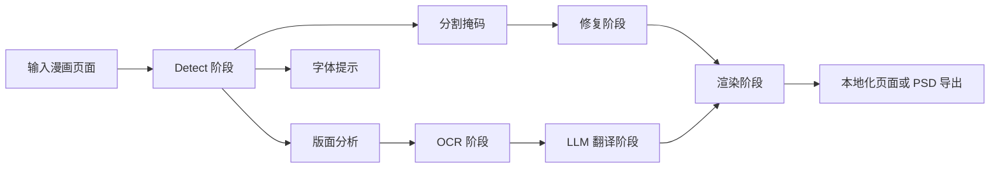

# Koharu 的工作方式

Koharu 围绕一条漫画翻译页面管线构建。用户看到的流程很简单，但实现上会刻意把版面分析、分割、OCR、修复、翻译和渲染拆成独立阶段。

## 管线总览

在公开的管线层面，Koharu 按以下顺序运行：

1. `Detect`
2. `OCR`
3. `Inpaint`
4. `LLM Generate`
5. `Render`

关键实现细节在于，`Detect` 本身已经是一个多模型阶段：

- `PP-DocLayoutV3` 负责找出类似文本的版面区域和阅读顺序
- `comic-text-detector` 生成逐像素的文本概率图
- `YuzuMarker.FontDetection` 估计后续渲染要用到的字体与颜色提示

正因为如此，Koharu 才能让一个模型负责“文字应该属于页面哪里”，另一个模型负责“究竟哪些像素应该被擦掉”。

## 每个阶段产出什么

| 阶段 | 主要模型 | 主要输出 |
| --- | --- | --- |
| Detect | `PP-DocLayoutV3`, `comic-text-detector`, `YuzuMarker.FontDetection` | 文本块、分割掩码、字体提示 |
| OCR | `PaddleOCR-VL-1.5` | 每个文本块识别出的原文 |
| Inpaint | `lama-manga` | 去除原文后的页面 |
| LLM Generate | 本地 GGUF LLM 或远程提供商 | 译文 |
| Render | Koharu renderer | 最终本地化页面或导出内容 |

## 为什么要拆成多阶段

漫画页面比普通文档 OCR 更难：

- 气泡形状不规则，经常弯曲
- 日文可能是纵排，旁边的注释或 SFX 又可能是横排
- 文本会压在背景、网点、速度线和分镜边框之上
- 阅读顺序本身就是页面结构的一部分，不只是像素问题

因此通常不能指望一个模型把所有事情都做好。Koharu 会先估计版面，再对裁剪出的区域做 OCR，再用分割掩码做清理，最后才把文本交给 LLM 翻译。

## 实现结构

从源码结构看，管线入口在 `koharu/src/pipeline/runner.rs`，视觉栈的协调逻辑主要在 `koharu-ml/src/facade.rs`。

一些重要的实现细节：

- detect 阶段先跑 `PP-DocLayoutV3`，再把文本类标签转换成 `TextBlock`
- OCR 之前会先去重高度重叠的框
- 文本方向会基于区域长宽比推断，这样纵排漫画文本能更早进入正确路径
- OCR 运行在裁剪后的文本区域上，而不是整页图像
- 修复阶段使用的是当前分割掩码，而不是简单矩形框
- 当你选择远程 LLM 时，Koharu 发送出去的是 OCR 文本，而不是整页图像

## 为什么这套技术栈很重要

Koharu 使用：

- [candle](https://github.com/huggingface/candle) 进行高性能推理
- [llama.cpp](https://github.com/ggml-org/llama.cpp) 进行本地 LLM 推理
- [Tauri](https://github.com/tauri-apps/tauri) 作为桌面壳
- 全栈 Rust 来保证性能与内存安全

## 本地优先设计

默认情况下，Koharu 会：

- 在本地运行视觉模型
- 在本地运行本地 LLM

如果你配置了远程 LLM 提供商，Koharu 只会把待翻译文本发送给该提供商。

## 想看更深的技术版本？

请参见 [技术深潜](technical-deep-dive.md)，了解模型类型、分割掩码理论、基于 FFT 的修复，以及维基百科图示和官方模型卡的背景说明。关于渲染器、纵排写字模式和当前版面限制，请参见 [文本渲染与纵排 CJK 布局](text-rendering-and-vertical-cjk-layout.md)。
