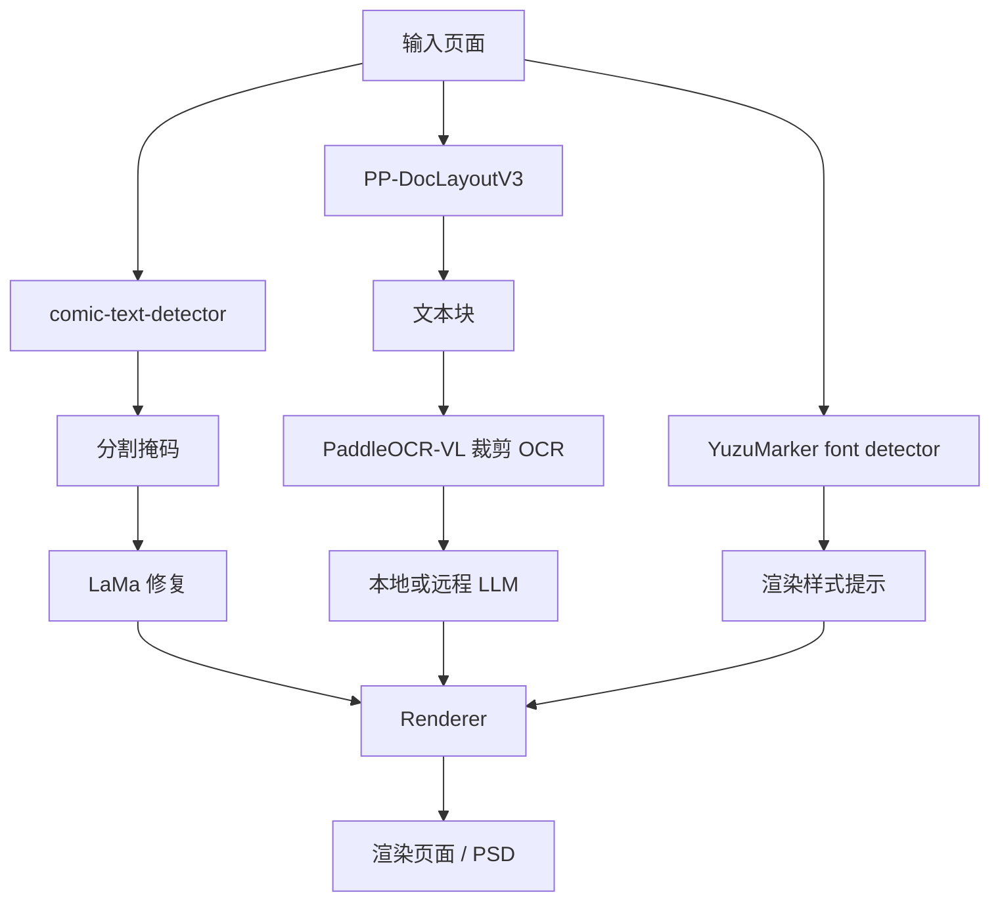

# 技术深潜

本页解释 Koharu 漫画处理管线的技术侧面：每个模型做什么、各阶段如何拼在一起，以及为什么漫画翻译必须把版面分析、分割掩码、OCR、修复和翻译拆开处理。

## 从实现角度看页面管线

从公开 API 看，Koharu 的主要流程是 `Detect -> OCR -> Inpaint -> LLM Generate -> Render`，但 detect 阶段本身已经同时做了三类工作：

- 页面版面分析
- 文本前景分割
- 字体与颜色估计

这是有意为之。漫画翻译工具既需要结构信息，也需要像素级精度。

## 模型类型总览

| 组件 | 默认模型 | 模型类型 | 在 Koharu 中的主要任务 |
| --- | --- | --- | --- |
| 版面分析 | [PP-DocLayoutV3](https://huggingface.co/PaddlePaddle/PP-DocLayoutV3_safetensors) | 文档版面检测器 | 找出文本类区域、标签、置信度与阅读顺序 |
| 分割 | [comic-text-detector](https://github.com/dmMaze/comic-text-detector) | 文本分割网络 | 生成用于清理的高密度文本掩码 |
| OCR | [PaddleOCR-VL-1.5](https://huggingface.co/PaddlePaddle/PaddleOCR-VL-1.5) | 视觉语言模型 | 将裁剪文本区域识别为 Unicode 文本 |
| 修复 | [lama-manga](https://huggingface.co/mayocream/lama-manga) / [LaMa](https://github.com/advimman/lama) | 图像修复网络 | 在去字后填补遮挡区域 |
| 字体提示 | [YuzuMarker.FontDetection](https://huggingface.co/fffonion/yuzumarker-font-detection) | 图像分类 / 回归模型 | 估计字体、颜色与描边提示 |
| 翻译 | 通过 [llama.cpp](https://github.com/ggml-org/llama.cpp) 运行的本地 GGUF 模型，或远程 API | 大多数本地场景下是 decoder-only LLM | 将 OCR 文本翻译到目标语言 |

## 为什么漫画页面特别需要版面分析

版面分析不只是“给文本画框”。在漫画页里，它还要回答：

- 哪些区域根本像文本
- 大致的阅读顺序是什么
- 某个文本块是否高到足以被当成纵排
- 哪些框应该在 OCR 前先去重
- 哪些区域是气泡、旁白、标题或其他版面类别

这是因为漫画页面本来就结构复杂：

- 气泡常常弯曲或倾斜
- 文本可能压在网点、速度线和复杂背景上
- 纵排日文和横排拉丁文本会同时存在
- 应该“读”的区域，与应该“擦掉”的像素，形状往往并不一样

Koharu 先根据布局输出创建 `TextBlock`，再用这些块驱动 OCR 和后续渲染。

在当前实现里，布局阶段会：

- 运行 `PP-DocLayoutV3::inference_one_fast(...)`
- 保留看起来像文本的标签区域
- 将它们转换成 `TextBlock`
- 去除高度重叠的候选框
- 根据长宽比推断横排还是纵排

因此，版面分析是整条漫画处理管线的结构骨架。

## 什么是分割掩码

分割掩码是一张与输入图像同尺寸的图，其中每个像素都表示它是否属于目标类别。在 Koharu 的场景里，目标类别基本就是“之后应当在清理阶段去除的文本前景”。

这和边界框不同：

| 表示方式 | 含义 | 最适合做什么 |
| --- | --- | --- |
| Bounding box | 粗粒度矩形区域 | OCR 裁剪、排序、UI 编辑 |
| Polygon | 更紧致的几何轮廓 | 行级几何表达 |
| Segmentation mask | 逐像素前景图 | 修复与精细清理 |

在 Koharu 中，分割路径有意和布局路径分开：

- `comic-text-detector` 生成灰度概率图
- Koharu 对概率图做后处理和细化
- 细化结果存入 `doc.segment`
- LaMa 再用 `doc.segment` 作为擦除与填补掩码

这个细化步骤很重要，因为原始分割概率通常是软的、带噪声的。Koharu 会对其阈值化、结合文本块做细化，并对最终二值掩码做膨胀，尽量覆盖文字边缘和描边，减少残影。

## 这些视觉模型在理论上如何工作

### 版面分析：检测器加阅读顺序推断

[PP-DocLayoutV3](https://huggingface.co/PaddlePaddle/PP-DocLayoutV3) 是一个面向文档解析的布局模型，擅长处理倾斜、形变和非平面失真。它的模型卡中有两个对漫画页尤其重要的点：

- 它预测的是多点几何，而不只是轴对齐矩形框
- 它会在同一次前向中同时预测逻辑阅读顺序

Koharu 的 Rust 端口保留了这种结构：`pp_doclayout_v3` 模块包含 `HGNetV2` 骨干以及注意力式编码器 / 解码器块，推理结果会暴露 `label`、`score`、`bbox`、`polygon_points` 和 `order`。

从概念上说，这更接近“目标检测 + 版面解析”，而不是单纯 OCR。

### 分割：密集逐像素文本预测

Koharu 的 `comic-text-detector` 路径本质上是以分割为核心的设计。Rust 端口会加载：

- 类 YOLOv5 的骨干网络
- 用于掩码预测的 U-Net 解码器
- 可选的 DBNet 检测头

默认页面管线使用“仅分割”路径，因为 Koharu 已经从 `PP-DocLayoutV3` 获得了布局框。也就是说，Koharu 组合了：

- 一个擅长页面结构的模型
- 一个擅长像素级文本前景的模型

对于图像清理来说，这比只靠边界框更合适。

### OCR：从图像裁剪到文本 token 的多模态解码

[PaddleOCR-VL](https://huggingface.co/docs/transformers/en/model_doc/paddleocr_vl) 是一个紧凑型视觉语言模型。官方文档指出，它结合了：

- NaViT 风格的动态分辨率视觉编码器
- ERNIE-4.5-0.3B 语言模型

在理论上，这里的 OCR 更像一个多模态序列生成问题：

1. 先把裁剪图像编码成视觉 token
2. 再用诸如 `OCR:` 的文本提示指定任务
3. 最后由解码器自回归地产生识别文本

Koharu 的实现非常接近这种模式：

- 加载 `PaddleOCR-VL-1.5.gguf` 和单独的多模态 projector
- 通过 `llama.cpp` 的多模态路径送入图像
- 使用 `OCR:` 作为提示
- 对每个裁剪块贪心解码文本

因此，Koharu 里的 OCR 并不是传统的纯 CTC 识别器，而是一个被限定在 OCR 任务上的小型文档 VLM。

### 修复：为什么 LaMa 使用傅里叶卷积

[LaMa](https://github.com/advimman/lama) 是一个面向大面积遮挡区域的图像修复模型。它论文标题就点明了核心思路：*Resolution-robust Large Mask Inpainting with Fourier Convolutions*。

直觉上：

- 普通卷积擅长局部信息
- 去字修复往往需要从更大范围背景中借上下文
- 频域操作可以更高效地建模大尺度结构

这里就会用到 FFT。

#### 这里的 FFT 是什么意思

FFT 是 **Fast Fourier Transform（快速傅里叶变换）**，它是一种在以下两个空间之间快速切换的算法：

- 像素所在的空间域
- 更容易表达重复模式和大尺度结构的频域

在 Koharu 的 LaMa 端口里，`FourierUnit` 会：

1. 对特征图做 `rfft2`
2. 对实部与虚部通道应用学习得到的 `1x1` 卷积
3. 再用 `irfft2` 回到图像空间

Koharu 甚至为 CPU、CUDA 和 Metal 实现了自定义 `rfft2` / `irfft2` 操作，因此同一套频域块可以跨硬件运行。

对于漫画清理来说，这很关键，因为缺失区域往往不是一个小洞，而可能是整个气泡内侧，里面还带着渐变、网点和边缘线稿。频域的全局混合能力更有利于保留大结构。

## 本地 LLM 与模型类型

Koharu 的本地翻译路径通过 `llama.cpp` 使用 GGUF 模型。实际中，它们通常是量化后的 decoder-only transformer。

理论上流程非常标准：

- 先将 OCR 文本分词
- 在不断增长的 token 序列上执行 masked self-attention
- 反复预测下一个 token，直到完成输出

实际取舍也很标准：

- 模型越大，通常翻译越好
- 更小的量化模型占用更少的 VRAM 和 RAM
- 远程提供商可以提供更大模型，但会带来隐私与依赖外部服务的权衡

即使你使用远程文本生成提供商，Koharu 也会把图像理解步骤留在本地。远端拿到的只是 OCR 文本。

## Koharu 实现中特别值得注意的点

如果你只看高层文档，下面这些实现细节很容易被忽略：

- detect 阶段当前加载的是 `ComicTextDetector::load_segmentation_only(...)`，而不是启用 DBNet 的完整检测模式
- 分割掩码会结合当前检测出的文本块做精细化，再进入修复阶段
- OCR 运行在裁剪后的文本块图像上，而不是整页原图
- OCR 封装使用的是 `llama.cpp` 的多模态路径，并采用 `OCR:` 提示
- 修复阶段直接消费 `doc.segment`，所以糟糕的掩码会直接导致糟糕的清理结果
- 渲染前会对字体预测做归一化，让接近纯黑或纯白的颜色更稳定

## 推荐阅读

### 官方模型与项目参考

- [PP-DocLayoutV3 model card](https://huggingface.co/PaddlePaddle/PP-DocLayoutV3)
- [PaddleOCR-VL-1.5 model card](https://huggingface.co/PaddlePaddle/PaddleOCR-VL-1.5)
- [Hugging Face Transformers 中的 PaddleOCR-VL 架构文档](https://huggingface.co/docs/transformers/en/model_doc/paddleocr_vl)
- [comic-text-detector 仓库](https://github.com/dmMaze/comic-text-detector)
- [LaMa 仓库](https://github.com/advimman/lama)
- [llama.cpp](https://github.com/ggml-org/llama.cpp)

### 背景理论与 Wikipedia 图示

如果你想先看基础理论和概览图，再去读模型卡，这些页面很有帮助：

- [Fourier transform](https://en.wikipedia.org/wiki/Fourier_transform)
- [Image segmentation](https://en.wikipedia.org/wiki/Image_segmentation)
- [Optical character recognition](https://en.wikipedia.org/wiki/Optical_character_recognition)
- [Transformer (deep learning architecture)](https://en.wikipedia.org/wiki/Transformer_(deep_learning_architecture))
- [Object detection](https://en.wikipedia.org/wiki/Object_detection)
- [Inpainting](https://en.wikipedia.org/wiki/Inpainting)

这些 Wikipedia 链接更适合做背景补充。想理解 Koharu 真实行为与实际模型选型，还是应以官方模型卡和源码实现为准。
