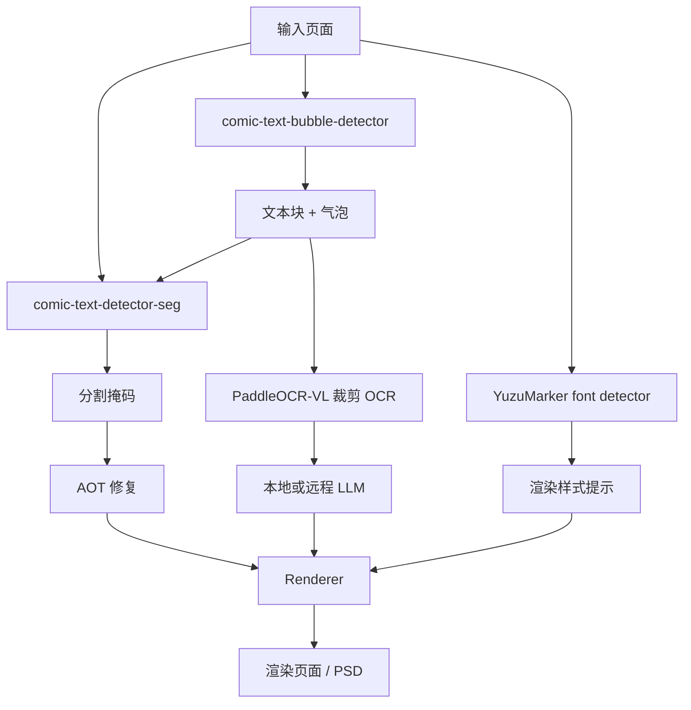
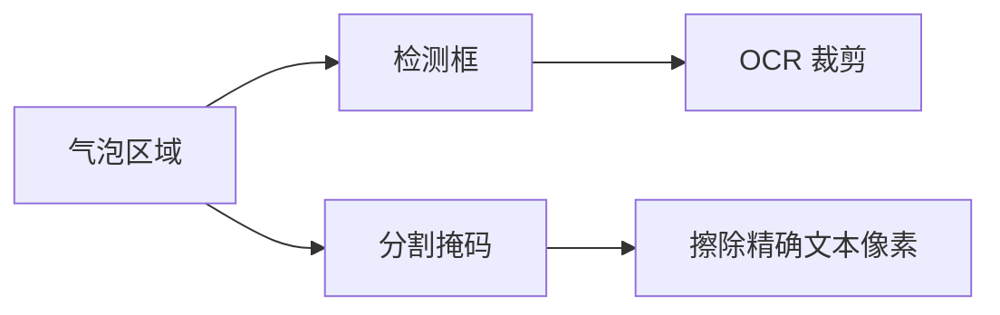

# 技术深潜

本页解释 Koharu 漫画处理管线的技术侧面：每个模型做什么、各阶段如何拼在一起，以及为什么漫画翻译必须把文本与气泡检测、分割掩码、OCR、修复和翻译拆开处理。

## 从实现角度看页面管线

从公开 API 看，Koharu 的主要流程是 `Detect -> OCR -> Inpaint -> LLM Generate -> Render`，但 detect 阶段本身已经同时做了三类工作：

- 文本和气泡检测
- 文本前景分割
- 字体与颜色估计

这是有意为之。漫画翻译工具既需要结构信息，也需要像素级精度。

## 模型类型总览

| 组件 | 默认模型 | 模型类型 | 在 Koharu 中的主要任务 |
| --- | --- | --- | --- |
| 文本 / 气泡检测 | [comic-text-bubble-detector](https://huggingface.co/ogkalu/comic-text-and-bubble-detector) | object detector | 找出文本块和气泡区域 |
| 分割 | [comic-text-detector](https://github.com/dmMaze/comic-text-detector) | 文本分割网络 | 生成用于清理的高密度文本掩码 |
| OCR | [PaddleOCR-VL-1.5](https://huggingface.co/PaddlePaddle/PaddleOCR-VL-1.5) | 视觉语言模型 | 将裁剪文本区域识别为 Unicode 文本 |
| 修复 | [aot-inpainting](https://huggingface.co/mayocream/aot-inpainting) / [manga-image-translator](https://github.com/zyddnys/manga-image-translator) | 图像修复网络 | 在去字后填补遮挡区域 |
| 字体提示 | [YuzuMarker.FontDetection](https://huggingface.co/fffonion/yuzumarker-font-detection) | 图像分类 / 回归模型 | 估计字体、颜色与描边提示 |
| 翻译 | 通过 [llama.cpp](https://github.com/ggml-org/llama.cpp) 运行的本地 GGUF 模型，或远程 API | 大多数本地场景下是 decoder-only LLM | 将 OCR 文本翻译到目标语言 |

内置替代引擎仍然可用。主要包括：作为替代检测 / 版面分析引擎的 [PP-DocLayoutV3](https://huggingface.co/PaddlePaddle/PP-DocLayoutV3_safetensors)、作为专用气泡检测器的 [speech-bubble-segmentation](https://huggingface.co/mayocream/speech-bubble-segmentation)，以及作为替代修复器的 [lama-manga](https://huggingface.co/mayocream/lama-manga)。

## 为什么文本和气泡检测在漫画页上很重要

检测不只是“给文字画框”。在漫画页里，它还要回答：

- 哪些区域看起来像文本
- 哪些区域是气泡
- 某个文本块是否高到足以被当成竖排
- 哪些框应该在 OCR 前先去重
- 哪些区域应该被转换成可编辑的 `TextBlock`

这是因为漫画页面本来就结构复杂：

- 气泡常常弯曲或倾斜
- 文本可能压在网点、速度线和复杂背景上
- 竖排日文和横排拉丁文本会同时存在
- 应该“读”的区域，与应该“擦掉”的像素，形状往往并不一样

Koharu 先根据检测结果创建 `TextBlock`，再用这些块驱动 OCR 和后续渲染。气泡区域会单独保留下来，供 UI 和后续工具继续使用。

在当前默认实现里，detect 阶段会：

- 运行 Candle 版 `ogkalu/comic-text-and-bubble-detector`
- 把文本检测结果转换成 `TextBlock`
- 把气泡检测结果转换成 `BubbleRegion`
- 在 OCR 前按漫画阅读顺序整理 text block

如果你更想用偏文档版面的检测器，`PP-DocLayoutV3` 仍然可以作为替代引擎使用，只是不再是默认选择。

## 什么是分割掩码

分割掩码是一张与输入图像同尺寸的图，其中每个像素都表示它是否属于目标类别。在 Koharu 的场景里，目标类别基本就是“之后应当在清理阶段去除的文本前景”。

这和边界框不同：

| 表示方式 | 含义 | 最适合做什么 |
| --- | --- | --- |
| Bounding box | 粗粒度矩形区域 | OCR 裁剪、排序、UI 编辑 |
| Polygon | 更紧致的几何轮廓 | 行级几何表达 |
| Segmentation mask | 逐像素前景图 | 修复与精细清理 |

在 Koharu 中，分割路径有意和检测路径分开：

- `comic-text-detector` 生成灰度概率图
- Koharu 对它做阈值化和膨胀等轻量后处理
- 结果保存到 `doc.segment`
- `aot-inpainting` 再把 `doc.segment` 作为擦除与填补掩码

这个后处理步骤仍然重要，因为原始分割概率通常是软的、带噪声的。Koharu 会先二值化，再对最终掩码做膨胀，尽量覆盖文字边缘和描边，减少残影。

## 这些视觉模型在理论上如何工作

### 联合检测：一次得到文本块和气泡区域

[ogkalu/comic-text-and-bubble-detector](https://huggingface.co/ogkalu/comic-text-and-bubble-detector) 成为默认检测器，是因为它直接预测了后续最关心的两类区域：

- 应该转换成 `TextBlock` 的文本区域
- 应该继续保留给编辑器和后续工具使用的气泡区域

Koharu 的 Candle 端口会把这些检测结果映射到文档结构里，并在 OCR 前按漫画阅读顺序排序文本块。从概念上说，这更接近页面目标检测，而不是 OCR 本身。

### 分割：密集逐像素文本预测

Koharu 的 `comic-text-detector` 路径本质上是以分割为核心的设计。Rust 端口会加载：

- 类 YOLOv5 的骨干网络
- 用于掩码预测的 U-Net 解码器
- 可选的 DBNet 检测头

默认页面管线使用“仅分割”路径，因为 Koharu 已经从 `comic-text-bubble-detector` 获得了 text block。也就是说，Koharu 组合了：

- 一个擅长页面级区域检测的模型
- 一个擅长像素级文本前景抽取的模型

对于图像清理来说，这比只靠边界框更合适。

### OCR：从图像裁剪到文本 token 的多模态解码

[PaddleOCR-VL](https://huggingface.co/docs/transformers/en/model_doc/paddleocr_vl) 是一个紧凑型视觉语言模型。官方文档指出，它结合了：

- NaViT 风格的动态分辨率视觉编码器
- ERNIE-4.5-0.3B 语言模型

在理论上，这里的 OCR 更像一个多模态序列生成问题：

1. 先把裁剪图像编码成视觉 token
2. 再用诸如 `OCR:` 的文本提示指定任务
3. 最后由解码器自回归地产生识别文本

Koharu 的实现非常接近这种模式：

- 加载 `PaddleOCR-VL-1.5.gguf` 和单独的多模态 projector
- 通过 `llama.cpp` 的多模态路径送入图像
- 使用 `OCR:` 作为提示
- 对每个裁剪块贪心解码文本

### 修复：为什么默认改成了 AOT

默认修复器是来自 [manga-image-translator](https://github.com/zyddnys/manga-image-translator) 的 AOT 模型，在 Koharu 中叫 `aot-inpainting`。它是一种 masked-image inpainting network，核心是 gated convolution 和带有多个 dilation rate 的上下文混合块。

直觉上，关键点在于：

- 去字修复不是简单的矩形填充
- 模型既要看到局部边缘细节，也要借用更大范围的气泡或背景上下文
- 多膨胀率上下文块是一种务实的上下文混合方式

Koharu 的 Candle 端口基本遵循上游推理流程：

1. 把过大的页面缩到设定的 max side
2. 把工作图像补齐到 multiple-of-8
3. 将 masked RGB 图像和二值文本掩码送入网络
4. 再把预测像素合成回原尺寸图像

`lama-manga` 仍然可以作为替代引擎选择，但已经不是默认项。

## 本地 LLM 与模型类型

Koharu 的本地翻译路径通过 `llama.cpp` 使用 GGUF 模型。实际中，它们通常是量化后的 decoder-only transformer。

理论上流程非常标准：

- 先将 OCR 文本分词
- 在不断增长的 token 序列上执行 masked self-attention
- 反复预测下一个 token，直到完成输出

即使你使用远程文本生成提供商，Koharu 也会把图像理解步骤留在本地。远端拿到的只是 OCR 文本。

## Koharu 实现中特别值得注意的点

如果你只看高层文档，下面这些实现细节很容易被忽略：

- 默认 detect 阶段是 `comic-text-bubble-detector`，而不是 `PP-DocLayoutV3`
- `comic-text-detector-seg` 仍然走 segmentation-only 的 `comic-text-detector` 路径来生成 `doc.segment`
- 分割掩码现在是通过阈值化加膨胀构建的，不再走旧的 block-aware refinement 逻辑
- OCR 运行在裁剪后的文本块图像上，而不是整页原图
- OCR 封装使用的是 `llama.cpp` 的多模态路径，并采用 `OCR:` 提示
- 修复阶段直接消费 `doc.segment`，所以糟糕的掩码会直接导致糟糕的清理结果
- 默认修复器是 `aot-inpainting`，`lama-manga` 仍可作为替代方案
- 渲染前会对字体预测做归一化，让接近纯黑或纯白的颜色更稳定

## 推荐阅读

### 官方模型与项目参考

- [comic-text-and-bubble-detector model card](https://huggingface.co/ogkalu/comic-text-and-bubble-detector)
- [PaddleOCR-VL-1.5 model card](https://huggingface.co/PaddlePaddle/PaddleOCR-VL-1.5)
- [Hugging Face Transformers 中的 PaddleOCR-VL 架构文档](https://huggingface.co/docs/transformers/en/model_doc/paddleocr_vl)
- [comic-text-detector 仓库](https://github.com/dmMaze/comic-text-detector)
- [manga-image-translator 仓库](https://github.com/zyddnys/manga-image-translator)
- [YuzuMarker.FontDetection model card](https://huggingface.co/fffonion/yuzumarker-font-detection)
- [PP-DocLayoutV3 model card](https://huggingface.co/PaddlePaddle/PP-DocLayoutV3)
- [LaMa 仓库](https://github.com/advimman/lama)
- [llama.cpp](https://github.com/ggml-org/llama.cpp)

### 背景理论与 Wikipedia 图示

如果你想先看基础理论和概览图，再去读模型卡，这些页面很有帮助：

- [Fourier transform](https://en.wikipedia.org/wiki/Fourier_transform)
- [Image segmentation](https://en.wikipedia.org/wiki/Image_segmentation)
- [Optical character recognition](https://en.wikipedia.org/wiki/Optical_character_recognition)
- [Transformer (deep learning architecture)](https://en.wikipedia.org/wiki/Transformer_(deep_learning_architecture))
- [Object detection](https://en.wikipedia.org/wiki/Object_detection)
- [Inpainting](https://en.wikipedia.org/wiki/Inpainting)

这些 Wikipedia 链接更适合做背景补充。想理解 Koharu 真实行为与实际模型选型，还是应以官方模型卡和源码实现为准。
