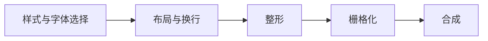
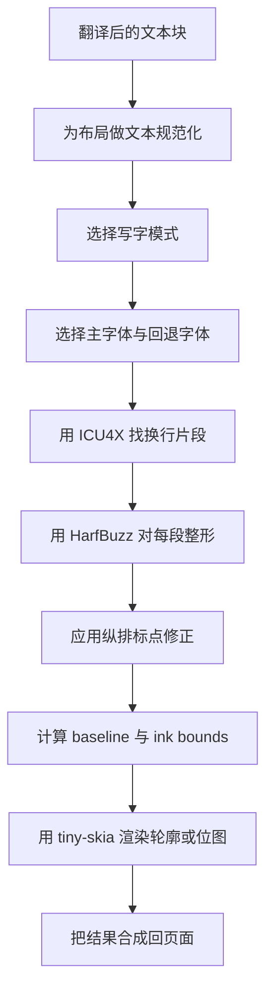

# 文本渲染与纵排 CJK 布局

文本渲染是漫画翻译里最难做好的部分之一。检测、OCR 和修复决定了“这页应该怎么处理”，而渲染器决定了结果看起来像不像真正的漫画字稿，而不是一层调试文字贴图。

一篇很值得参考的外部文章是 Aria Desires 的 [Text Rendering Hates You](https://faultlore.com/blah/text-hates-you/)。它的核心结论同样适用于 Koharu：文本渲染不是一条干净线性的流程，也不存在对所有情况都完美的答案。布局、整形、字体回退、栅格化和合成之间会互相牵制。

Koharu 并不想成为一个通用桌面排版引擎。它的目标是把漫画场景最常见、最关键的文本排版问题做好，尤其是纵排 CJK 气泡文本。

## 为什么这件事本来就很难

Faultlore 那篇文章把文本渲染拆成几个常见阶段：

这个图有帮助，但真实实现中这些阶段并不独立：

- 在知道字形 advance 之前，你没法知道最终换行
- 在知道写字方向和 OpenType feature 之前，你没法可靠整形
- 一个字体通常覆盖不了所有脚本、符号和 emoji，所以字体回退不可避免
- 你不能按 code point 一个一个地画，因为真实文本需要先整形成 glyph run
- 气泡框不等于真实 ink bounds，二者经常不一样

纵排漫画文本又把问题进一步放大：

- 列内是自上而下，但列与列之间是自右向左
- 标点往往需要纵排替代形或额外居中
- 有些字体提供真正的纵排支持，有些并没有
- 同一个文本块里可能混有日文、中文、拉丁字母、数字、符号和 emoji

## Koharu 实际上怎么做

从实现上看，渲染器位于 `koharu-renderer` crate，核心协作逻辑分布在：

- `src/facade.rs`
- `src/layout.rs`
- `src/shape.rs`
- `src/segment.rs`
- `src/renderer.rs`

对单个已翻译 `TextBlock` 来说，大致流程是：

更具体一点：

- `LineBreaker` 使用 ICU4X 做断行
- `TextShaper` 通过 `harfrust` 调用 HarfBuzz
- `TextLayout` 把整形结果变成横排行或纵排列
- `TinySkiaRenderer` 使用 `skrifa` 渲染轮廓字形，必要时回退到 `fontdue` 位图
- `Renderer::render_text_block` 把这些步骤和字体提示、描边、页面摆放连接起来

## Koharu 如何决定是否使用纵排

Koharu 不会简单地把所有 CJK 文本都强制变成纵排。当前 `text/script.rs` 里的启发式规则是：

- 如果译文里包含 CJK 文本，并且文本块“高大于宽”，就使用 `VerticalRl`
- 否则保持横排

也就是说，纵排选择同时依赖：

- 脚本检测
- 检测出的或手工调整后的文本框几何形状

这种规则刻意保持简单。对漫画气泡文本来说，它已经能覆盖很大一部分常见情况，同时也避免了“只因为混进一个日文字符，就把整段说明文字都变成纵排”的问题。

但它终究是启发式，而不是完整的写字模式引擎，这也是当前渲染器的限制之一。

## 纵排 CJK 是如何实现的

### 1. 写字模式会真实进入整形阶段

`WritingMode::VerticalRl` 并不是渲染完成后再整体旋转一下。

Koharu 会在 HarfBuzz 整形之前，把它转换成自上而下的整形方向。这样字体和整形引擎就有机会产出真正的纵排 advance 和纵排字形，而不是“先横排后旋转”的假象。

### 2. 会启用纵排 OpenType 特性

在纵排模式下，Koharu 会启用：

- `vert`
- `vrt2`

这正是字体用于纵排替换字形的标准 OpenType feature。这也是 Koharu 的纵排输出比“把横排文字旋转 90 度”看起来更像真的一个重要原因。

如果字体本身提供了正确的纵排替代字形，Koharu 就能用上；如果字体没有，那结果也只能退化到字体能提供的程度。

### 3. “行”会变成“列”

在纵排模式下，布局逻辑会把主轴换成高度：

- `max_height` 用来限制一列
- 列内 advance 取自 `y_advance`
- 每一“行”实际上就是新的一列

随后 baseline 会被布置成：

- 列内字形自上而下推进
- 第一列放在右侧
- 后续列按行高向左依次移动

这就是传统漫画气泡常见的 `vertical-rl` 书写流向。

### 4. 全角标点会被重新居中

纵排 CJK 一旦对标点处理不好，观感会立刻变差。Koharu 对全角标点做了显式处理，并根据字体真实 bounds 对这些字形重新居中。

覆盖的范围包括：

- 句号、顿号等表意标点
- 全角标点区块
- 各类括号与角标记
- 中点和类似符号

这不是锦上添花，而是让纵排输出看起来“像排版过的文字”而不是“被凑出来的文字”的关键部分。

### 5. 强调标点会先做归一化

布局代码还会在纵排场景下对 `!`、`?` 这类强调标点组合做预处理，把重复或配对标点转成更适合纵排的对应 Unicode 组合形式。

这样能避免在狭窄竖列中堆叠出很生硬的横排标点效果。

### 6. 会精确测量 ink bounds

布局完成后，Koharu 会基于每个字形的 metrics 计算一套更紧致的 ink bounding box，然后平移 baseline，使真实墨迹区域从 `(0, 0)` 开始。

这很重要，因为：

- 仅靠字体全局 metrics 不足以避免裁切
- 纵排标点和替代字形经常会产生意外的边界
- 轮廓字形和位图字形需要可靠地落在同一块渲染表面上

实际使用中，这个 bounds 步骤让渲染结果稳定得多，不至于总是削掉顶部、底部或右边缘。

## 为什么它在漫画气泡里表现不错

Koharu 当前已经把几件对漫画最关键的事做对了：

- 使用真实文本整形，而不是逐字符绘制
- 启用纵排字体特性，而不是先排好再整体旋转
- 支持纵排 CJK 常见的自右向左列流
- 用 ICU4X 做断行，而不是手搓一个按字符分割的换行器
- 当主字体缺字符时，可以跨字体回退到符号或 emoji 字体
- 在纵排模式下对全角标点做重新居中
- 已有专门测试检查纵排方向，以及日文 / 简中纵排渲染输出

这套组合就是为什么它能输出“看起来是认真做过的”纵排 CJK，而不是只做到“勉强支持”。

## 那它有多完美？

对常见漫画场景来说，它已经很强。但它不是一个完整、完美的日文专业排版引擎。

更准确的说法是：

- 远好于简单旋转横排文本
- 对现代 CJK 字体和常见气泡文本效果很好
- 明确针对漫画翻译工作流调优过
- 仍然是 best-effort，而不是全场景 typographically perfect

## 当前限制

### 写字模式仍然是启发式

纵排选择目前依赖：

- 译文是否包含 CJK
- 文本块是否高于宽

这对大多数气泡有效，但对混合脚本说明、特殊旁注和某些 SFX 仍然可能需要手工修正。

### CJK 换行仍使用 ICU 默认行为

`segment.rs` 里明确留下了面向 CJK 特化的 `TODO`。也就是说，尽管 ICU4X 已经比临时规则好很多，但它目前还不是专门为漫画 kinsoku 规则定制的断行器。

### 字体支持会显著影响结果

纵排替代字形的效果有多好，取决于你最终选到的字体。如果系统字体本身不提供成熟的纵排字形形式，渲染器也不可能凭空补出完整的专业 CJK 字体能力。

### 不是完整出版排版引擎

Koharu 并不打算实现所有高级文本排版功能。当前渲染器并没有完整覆盖下列能力：

- ruby 注音
- warichu 等更高级的日文排版特性
- 与复杂连字相协调的多段混合样式
- 面向每个 glyph run 的细粒度专业排版控制

### 译文长度仍然会直接影响排版质量

即便整形做得再好，如果译文本身过长、过啰嗦，或者文本框几何很糟，渲染器也不可能总把结果变成完美字稿。

## 为什么 Koharu 不直接旋转文本

最偷懒的纵排办法，就是先按横排排版，再把结果整体旋转。Koharu 避免这么做，因为常见失败模式太明显：

- 标点位置不对
- advance 错误
- 列流看起来不自然
- 字体无法应用自己的纵排替代形
- bounds 与裁切会更难控制

Koharu 把纵排处理前移到了整形与布局阶段，这就是它纵排 CJK 输出看起来更自然的核心架构决策。

## 值得读的外部参考

[Text Rendering Hates You](https://faultlore.com/blah/text-hates-you/) 很值得看，因为它从更通用的角度解释了渲染器为什么这么难做。Koharu 的技术栈和浏览器引擎不同，但其中的核心经验完全一致：

- 整形不是可选项
- 字体回退不可避免
- 布局与整形相互依赖
- “完美文本渲染”通常只是实现之前的一种错觉

一句话总结：Koharu 的渲染器之所以这么小心，是因为文本渲染这件事本来就非常刁钻。
